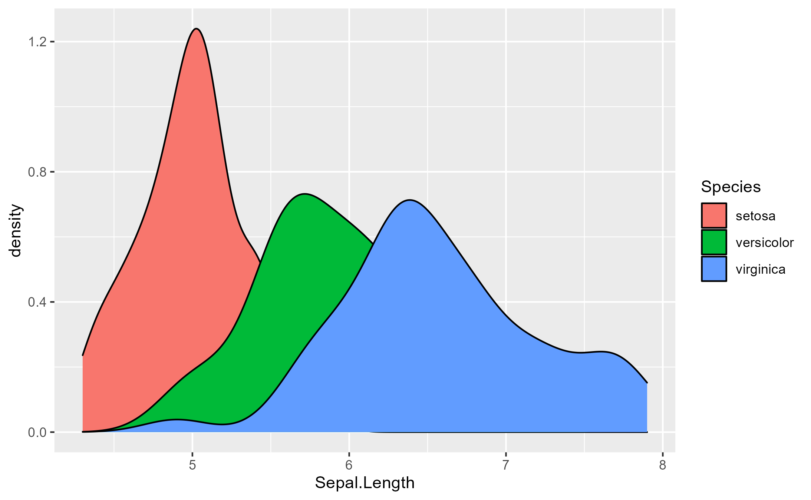

background-image: url(https://upload.wikimedia.org/wikipedia/commons/b/be/Sharingan_triple.svg)

```{r setup, include=FALSE}
options(htmltools.dir.version = FALSE)
knitr::opts_chunk$set(collapse = TRUE,
                      fig.retina = 3,
                      echo = FALSE,
                      fig.align='center')
library(ggplot2)
library(downloadthis)
library(countdown)
library(emo)
library(xaringanExtra)
xaringanExtra::use_tile_view()
xaringanExtra::use_clipboard()
xaringanExtra::use_webcam()
xaringanExtra::use_share_again()
xaringanExtra::use_fit_screen()
xaringanExtra::use_panelset()
xaringanExtra::use_scribble()
xaringanExtra::use_tachyons()
xaringanExtra::use_extra_styles(hover_code_line = TRUE, mute_unhighlighted_code = TRUE)
xaringanExtra::use_progress_bar(color = "#0051BA", location = "top", height = "10px")
xaringanExtra::use_broadcast()
```

???

Image credit: [Wikimedia Commons](https://commons.wikimedia.org/wiki/File:Sharingan_triple.svg)

---
class: center, middle

# xaringan

### /ʃaː.'riŋ.ɡan/

---
class: inverse, center, middle

# Get Started

---

# .big-text[Hola mundo! `r emo::ji("smile")`] 

```{r eval=FALSE, tidy=FALSE}
remotes::install_github("yihui/xaringan")
```

You are recommended to use the [RStudio IDE](https://www.rstudio.com/products/rstudio/), but you do not have to.

- Create a new R Markdown document from the menu `File -> New File -> R Markdown -> From Template -> Ninja Presentation`;<sup>1</sup>

--

- Click the `Knit` button to compile it;

--

- or use the [RStudio Addin](https://rstudio.github.io/rstudioaddins/)<sup>2</sup> "Infinite Moon Reader" to live preview the slides (every time you update and save the Rmd document, the slides will be automatically reloaded in RStudio Viewer.

---
background-image: url(`r xaringan:::karl`)
background-position: 50% 50%
class: center, bottom, inverse

# You only live once!

---

# Hello Ninja

As a presentation ninja, you certainly should not be satisfied by the "Hello World" example. You need to understand more about two things:

1. The [remark.js](https://remarkjs.com) library;

1. The **xaringan** package;

Basically **xaringan** injected the chakra of R Markdown (minus Pandoc) into **remark.js**. The slides are rendered by remark.js in the web browser, and the Markdown source needed by remark.js is generated from R Markdown (**knitr**).

---

# remark.js

You can see an introduction of remark.js from [its homepage](https://remarkjs.com). You should read the [remark.js Wiki](https://github.com/gnab/remark/wiki) at least once to know how to

- create a new slide (Markdown syntax<sup>*</sup> and slide properties);

- format a slide (e.g. text alignment);

- configure the slideshow;

- and use the presentation (keyboard shortcuts).

It is important to be familiar with remark.js before you can understand the options in **xaringan**.

.footnote[[*] It is different with Pandoc's Markdown! It is limited but should be enough for presentation purposes. Come on... You do not need a slide for the Table of Contents! Well, the Markdown support in remark.js [may be improved](https://github.com/gnab/remark/issues/142) in the future.]

---
background-image: url(`r xaringan:::karl`)
background-size: cover
class: center, bottom, inverse

# I was so happy to have discovered remark.js!

---
class: inverse, middle, center

# Using xaringan

---
# .center[Ejercicio 1]

```{r echo=FALSE}
countdown(minutes = 5, top = 0, font_size = "3em")
```

.panelset[
  
  .panel[.panel-name[Salida]
```{r ejer1, echo=FALSE}
# names of created objects
c <- c(1:3)
c
```
         
         
  ]
  
  .panel[.panel-name[Código en R]
```{r echo=T, eval=FALSE}
c <- c(1:3)
c
```         
         
  ]
  
]

---

# .center[Ejercicio 2]

```{r echo=FALSE}
countdown(minutes = 2, top = 0, font_size = "2em")
```

.panelset[
  .panel[.panel-name[Salida]
  
```{r ejer2-1, echo=FALSE, eval=FALSE}
# Gráfico en R
ggplot(iris, aes(x = Sepal.Length, fill = Species))+ 
  geom_density()#<<
ggsave("ejer2.png") 
```


# Gráfico en R

```{r echo=FALSE, out.width="80%"}

```
       
]
    .panel[.panel-name[Código en R]


```{r echo=T, eval=FALSE,  fig.width=2, fig.height=4}
# Código en R base para la generación de un 
# gráfico de dispersión

ggplot(iris, aes(x = Sepal.Length, fill = Species))+ 
  geom_density()
```

  ]
  
]


---

# Gráfico por fuera de tabset

```{r  echo=FALSE, eval=TRUE,  fig.width=2, fig.height=4}
# Código en R base para la generación de un 
# gráfico de dispersión

ggplot(iris, aes(x = Sepal.Length, fill = Species))+ 
  geom_density()
```


---

# Descargar archivos

```{r echo=FALSE, eval=TRUE,  fig.width=6, fig.height=4}
# Código en R base para la generación de un 
# gráfico de dispersión

ggplot(iris, aes(x = Sepal.Length, fill = Species))+ 
  geom_density()
``` 


```{r echo=FALSE}
iris %>%
  download_this(
    output_name = "Datos",
    output_extension = ".xlsx",
    button_label = "Descargar archivo en Excel",
    button_type = "warning",
    has_icon = TRUE,
    icon = "fa fa-save")
```

