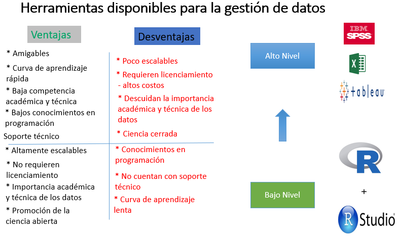

class: center, middle
exclude: true

```{r setup, include=FALSE}
options(htmltools.dir.version = FALSE)
knitr::opts_chunk$set(collapse = TRUE,
                      fig.retina = 3,
                      echo = FALSE,
                      fig.align='center')
library(ggplot2)
library(downloadthis)
library(webexercises)
library(countdown)
library(emo)
library(icons)
library(xaringanExtra)
library(fontawesome)
library(gapminder)
library(UnalData)
library(writexl)
library(dplyr)
library(readxl)
library(downloadthis)
library(datasauRus)
library(UnalR)
library(janitor)
library(skimr)
library(DataExplorer)
library(summarytools)
xaringanExtra::use_tile_view()
xaringanExtra::use_clipboard()
xaringanExtra::use_webcam()
# xaringanExtra::use_share_again()
xaringanExtra::use_fit_screen()
xaringanExtra::use_panelset()
xaringanExtra::use_scribble()
xaringanExtra::use_tachyons()
xaringanExtra::use_extra_styles(hover_code_line = TRUE, mute_unhighlighted_code = TRUE)
xaringanExtra::use_progress_bar(color = "#0051BA", location = "top", height = "10px")
xaringanExtra::use_broadcast()
```

---

class: title-slide, center, middle, hide-count, hide-logo

background-image: url("https://www.arquitecturapanamericana.com/wp-content/gallery/edificio-facultad-de-enfermeria-universidad-nacional-de-colombia-sede-bogota/1158ARN.jpg")
background-size: cover

# .big-text.black[ <p style="color:#ffffff;">Estadística Aplicada a la Investigación</p>
]

<br>
<br>
<br>
<br>
<br>
<br>

.footnote[
.white[Créditos de la Imagen: ][Arquitectura Panamericana](https://www.arquitecturapanamericana.com/wp-content/gallery/edificio-facultad-de-enfermeria-universidad-nacional-de-colombia-sede-bogota/1158ARN.jpg)
]

---
name: modulo0

class: title-slide, left, middle, hide-count, hide-logo

background-image: url("https://images.unsplash.com/photo-1638366271870-8b3d428f27f8?ixlib=rb-1.2.1&ixid=MnwxMjA3fDB8MHxwaG90by1wYWdlfHx8fGVufDB8fHx8&auto=format&fit=crop&w=1771&q=80")
background-size: cover

# .black.big-text[Características del Curso]
## .black[Aspectos Generales]

.footnote[
.white[Image credits:][Markus Spiske](https://images.unsplash.com/photo-1638366271870-8b3d428f27f8?ixlib=rb-1.2.1&ixid=MnwxMjA3fDB8MHxwaG90by1wYWdlfHx8fGVufDB8fHx8&auto=format&fit=crop&w=1742&q=80)
]

---
class: center, middle

# `r emo::ji("teacher")` <br> ¿Quién Será Su Profesor?<br>Su Tutor<br>Su "Compañero"

---
class: middle, hide-logo

.pull-left[
```{r , echo=FALSE, out.width="65%", fig.align='left'}
knitr::include_graphics("imagenes/Foto.jpg") 
```

* Alberto Rodríguez R
* Docente Ocasional - Facultad de Enfermería <br>
  Universidad Nacional de Colombia - UNAL
* Asesor - Dirección Nacional de Planeación y Estadística - [DNPE](http://planeacion.unal.edu.co/home/)<br>`r icons::fontawesome$brands$twitter` [@tipsder](https://twitter.com/tipsder)<br>`r icons::fontawesome$brands$github` [estadisticaun](https://github.com/estadisticaun)<br>`r icons::fontawesome$solid$envelope` [albrodriguezr@unal.edu.co](albrodriguezr@unal.edu.co)
<br>`r icons::fontawesome$brands$chrome` [https://albertor.netlify.app/](https://albertor.netlify.app/)
]

.pull-right[
# ¡Algunos datos de interés!
<br>
<br>
<br>
<br>
# .big-text[Bienvenidos!`r emo::ji("blush")`]

]


---
class: center, middle

# `r emo::ji("student")` <br> ¿Quiénes son los Estudiantes de Este Curso?<br><br><br>¡Su Turno!

---

# .big-text[`r emo::ji("scroll")` Contenido del Curso - Módulos] 
1. [Módulo: Estadística Descriptiva y Exploratoria (5 sesiones)](#modulo1)

1. [Módulo: Probabilidad e Inferencia Estadística (6 sesiones)](#modulo2)

1. [Módulo: Modelamiento Estadístico (1 sesión)](#modulo3)

1. [Módulo: Comunicación de Resultados (1 sesión)](#modulo4)

---

# Enfoque del Curso


---

# Módulo 1: Estadística Descriptiva y Exploratoria


---

# Módulo 2: Probabilidad e Inferencia Estadística


---

# Módulo 3: Modelamiento Estadístico


---

# Módulo 4: Comunicación de Resultados


---

# Características de la asignatura y su desarrollo

--

- Asignatura virtual.

--

- Asignatura con amplio contenido

--

- Asignatura teórico práctica. Con énfasis en componentes prácticos.

--

- Desarrollo de ejercicios en clase.

--

- Uso de software estadístico libre **-sin costos-.**

--

- Competencia en **programación** básica para su desarrollo.

--

- Estructura de calificaciones enfocada en lo práctico: 2 talleres (60%) y un trabajo final (40%) desarrollado en PDF o HTML.

--

- Una característica final. Más que sus profesores, nuestra función en esta asignatura es ser sus asesores, mentores o compañeros adelantados. 

--
<br>
<br>
<br>

<p style="background-color:tomato;text-align: center;"><b>Lo más importante </b><br> ¡Sintánse libres de consultar y expresar todas sus dudas por pequeñas que estas parezcan!</p>

---

# Softwares Estadísticos Seleccionados


<br>
<br>
```{r , echo=FALSE, out.width="50%", fig.align='center'}
knitr::include_graphics("imagenes/R-rstudio.png") 
```

.footnote[
Ir a sitios web de los softwares seleccionados: <br> [R](https://www.r-project.org/) <br>
[Rstudio](https://www.rstudio.com/) <br><br>
Para más información sobre otros softwares estadísticos útiles para la gestión estadística y de datos, los invitamos a ir al [Capítulo 2](https://bookdown.org/gboccardo/manual-ED-UCH/como-definir-que-y-cuantos-software-de-analisis-estadistico-manejar.html) del libro **RStudio para Estadística Descriptiva en Ciencias Sociales**. [Ir al libro](https://bookdown.org/gboccardo/manual-ED-UCH/)
]


---
class: middle, hide-logo

.pull-left[
## ¿Qué es R? `r fa("r-project", fill = "steelblue")`

“R es un ambiente de programación formado por un conjunto de herramientas muy flexibles que pueden ampliarse fácilmente mediante paquetes, librerías o definiendo nuestras propias funciones.”<br><br>
[Extraido de: Máxima Formación](https://www.maximaformacion.es/blog-dat/que-es-r-software/)

```{r , echo=FALSE, out.width="95%", fig.align='left'}
knitr::include_graphics("imagenes/R.png")
```

]

.pull-right[
## ¿Qué es Rstudio? 

“RStudio es un entorno de desarrollo integrado (IDE) para el lenguaje de programación R.”
<br><br>

[Extraido de: Wikipedia](https://es.wikipedia.org/wiki/RStudio)

```{r , echo=FALSE, out.width="95%", fig.align='left'}
knitr::include_graphics("imagenes/Rstudio.png")
```
]

---
# Breve historia y autores de R

" ... en 1991 en el Departamento de Estadística de la ***Universidad de Auckland en Nueva Zelanda***, **Ross Ihaka y Robert Gentleman** crean R como un subdialecto de S e implementado su propio dialecto. El nombre de R es debido a la primera letra de sus creadores **Ross** y **Robert**. Anunciándolo en 1993 al público y en 1995 Martin Machler convence a Ross y Robert de usar la Licencia Publica General GNU haciendo a R como software libre. " [Extraido de: Estadística con R](http://rstadistica.blogspot.com/2015/10/historiaR.html)

```{r , echo=FALSE, out.width="40%", fig.align='center'}
knitr::include_graphics("imagenes/AutoresR.jpg")
```


[Autores <br> Izquierda: Ross Ihaka](https://en.wikipedia.org/wiki/Ross_Ihaka)<br> [Derecha: Robert Gentleman](https://en.wikipedia.org/wiki/Robert_Gentleman_(statistician))


---
# ¡Un poco más sobre el poder de R!

<iframe width="100%" height="400" src="https://www.youtube.com/embed/XcBLEVknqvY" frameborder="0" allow="autoplay; encrypted-media" allowfullscreen></iframe>

.footnote[
Más detalles de la historia de R en: <br> [Historia de R en Detalle, por Andrew Zieffler](https://www.datadreaming.org/post/a-history-of-r/)]

---

# R y Rstudio: `r emo::ji("happy")` <FONT COLOR="green">ventajas</FONT>  y <FONT COLOR="red">desventajas</FONT> `r emo::ji("frowning")`

```{r , echo=FALSE, out.width="90%", fig.align='center'}
knitr::include_graphics("imagenes/Herramientas.png") 
```


---
class: middle, hide-logo

.pull-left[
### UNA ANALOGÍA:<br> ¡Excel, SPSS, Tableau, otros! 
```{r , echo=FALSE, out.width="32%", fig.align='center'}
 
```

```{r , echo=FALSE, out.width="81%", fig.align='left'}
knitr::include_graphics("imagenes/Spss.jpg")
```

<br>
<br>
<br>
<br>
.footnote[
Créditos de la imagén (arriba):  [Brian Matangelo](https://unsplash.com/photos/gRof2_Ftu7A) <br>
<br>
Créditos de la imagén (derecha):  [Kevin Oetiker](https://unsplash.com/photos/ReYGRz3shIg)
]

]

.pull-right[
<!-- Icónos tomados de https://fontawesome.com/v4.7/icons/ -->
### `r fa("r-project", fill = "steelblue")`  ¡R y Rstudio!
```{r , echo=FALSE, out.height="100%", fig.align='left'}
knitr::include_graphics("imagenes/RyRstudio.jpg") 
```
]

---
# ¿Cómo instalar R y Rstudio en nuestras computadoras?
<br><br>

### Para instalar R y Rstudio en nuestras computadoras, los invitamos a seguir los pasos definidos en el Capítulo 1, [Instalar R y Rstudio](https://rbasico.netlify.app/1-instalar), del libro [Un Primer Curso de R.](https://rbasico.netlify.app/) <br> Ir al contenido de este documento dando click en el siguiente enlace. <br>
[https://rbasico.netlify.app/1-instalar](https://rbasico.netlify.app/1-instalar)


---
# Una Primera Panorámica de R

```{r , echo=FALSE, out.height="100%", fig.align='center'}
 
```

---
# Una Primera Panorámica de Rstudio

```{r , echo=FALSE, out.height="100%", fig.align='center'}
knitr::include_graphics("imagenes/PantallaRstudio.png") 
```

---
# Interfaz de Rstudio - Características

```{r , echo=FALSE, out.height="100%", fig.align='center'}
knitr::include_graphics("imagenes/Interfaz_RStudio.jpg") 
```

.footnote[
.black[Crédito de la imagen: ][Ciencia de Datos para Gente Sociable
](https://bitsandbricks.github.io/ciencia_de_datos_gente_sociable/una-presentaci%C3%B3n-a-toda-marcha-de-r.html#nuestro-primer-proyecto-en-r)
]

---
# Mi primer Script / Código en R
.pull-left[

## Pasos


- Ir a la opción del menú: <br> `File -> New File  -> R Script`.

- En la hoja/pestaña que se abre - `panel de edición`- colocar un primer comentario antecedidio de la letra (#). El comentario debe ser "#Mi primer códido de R"

- Asignar a una variable llamada **Edad** el valor 45 (edad del profesor).

- Mostrar los valores de la variable **Edad** en la Consola.
]

.pull-rigth[

## El resultado

```{r, echo=TRUE,eval=FALSE}
# Mi primer código de R

# Edad del profesor
Edad <- 45

# Imprimir/mostrar el resultado
Edad
print(Edad)
```
]


---
# .center[¡Vamos a un receso!]

```{r, echo=FALSE}
countdown(minutes = 15, seconds = 0, 
          left = 0, right = 0, top = 0.5,
          padding = "50px",
          margin = "5%",
          font_size = "6em")

```


---

name: modulo1

class: title-slide, right, middle, hide-count, hide-logo

background-image: url("https://images.unsplash.com/photo-1591903934817-c02acbfd4665?ixlib=rb-1.2.1&ixid=MnwxMjA3fDB8MHxwaG90by1wYWdlfHx8fGVufDB8fHx8&auto=format&fit=crop&w=1932&q=80")
background-size: cover

<br>
<br>
<br>
<br>

# .black.big-text[Estadística<br>Descriptiva y Exploratoria]
## .black[Módulo - 1]

.footnote[
.white[Crédito de la imagen:][Karina L](https://unsplash.com/photos/zJRQ5nngdPA)
]

---
class: center, middle

# Sesión 1

# Tipos de Variables

---
# Definición de Variable Estadística

"Una variable estadística es una característica que puede fluctuar y cuya variación es susceptible a adoptar diferentes valores, los cuales pueden medirse u observarse." <br> [Extraido de: Wikipedia](https://es.wikipedia.org/wiki/Variable_estadística)

"La variable es una característica, cualidad o propiedad observada que puede adquirir diferentes valores y es susceptible de ser cuantificada o medida en una investigación. Para ser nominada como tal, debe tener la posibilidad de variar entre dos valores, como mínimo."<br> [Extraido de: Revista Scielo](http://www.scielo.org.pe/scielo.php?script=sci_arttext&pid=S2227-47312021000100016)

"Una variable estadística es una característica de una muestra o población de datos que puede adoptar diferentes valores."<br> [Extraido de: Economipedia](https://economipedia.com/definiciones/variable-estadistica.html)


---
name: variables
# .center[Tipos de Variables]

.panelset[
  
  .panel[.panel-name[Por Influencia]
  
  #### Variables independientes
  
  "Una variable independiente es aquella cuyo valor no depende de otra variable. Es aquella característica o propiedad que se supone es la causa del fenómeno estudiado. En investigación experimental se llama así a la variable que el investigador manipula."
  
  #### Variables dependientes
  
"Una variable dependiente es aquella cuyos valores dependen de los que tomen otra variable. La variable dependiente es una función que se suele representar por la y. La variable dependiente se representa en el eje ordenadas. Son las variables de respuesta que se observan en el estudio, y que podrían estar influidas por los valores de las variables independientes."

<br>

[Fuente: Wikipedia](https://es.wikipedia.org/wiki/Variable_estad%C3%ADstica#Seg%C3%BAn_la_influencia)
]
  
  .panel[.panel-name[Por Nivel de Medida]
   
   #### Variables Cualitativas
   
"Son el tipo de variables que como su nombre lo indica expresan distintas cualidades, características o modalidad. Cada modalidad que se presenta se denomina atributo o categoría, y la medición consiste en una clasificación de dichos atributos. Las variables cualitativas pueden ser [dicotómicas](https://es.wikipedia.org/wiki/Variable_estadística#Según_el_nivel_de_medida) cuando solo pueden tomar *dos valores posibles*, como sí y no, hombre y mujer o ser [politómicas](https://es.wikipedia.org/wiki/Variable_estadística#Según_el_nivel_de_medida) cuando pueden adquirir *tres o más valores*. Dentro de ellas podemos distinguir: variables ordinales y variables nominales"
   
   #### Variables Cuantitativas
   
"Son las variables que toman como argumento cantidades numéricas, son variables matemáticas. Las variables cuantitativas además pueden ser: variables discretas y variables continuas"

<br>

[Fuente: Wikipedia](https://es.wikipedia.org/wiki/Variable_estadística#Según_el_nivel_de_medida)
]

  
  .panel[.panel-name[Numéricas]
   
También llamadas variables cuantitativas. Describen una característica en términos de un valor numérico o cantidad. Pueden ser de dos subtipos.

#### Variables Continuas

"Son aquellas características que son medidas dentro de un rango continuo infinito de valores numéricos y se registran con números reales. Pueden presentar cualquier valor dentro de cierto intervalo.

<p style="color:green;">Ejemplos: Estatura (176 cm), peso(55.6 kg), Tamaño de lesión de leishmaniasis (6.07mm), etc.</p>

#### Variables Discretas

"Son también llamadas discontinuas, y están asociadas a conteos o enumeraciones, razón por la cual, solo permiten ser registradas con números enteros (0,1,2,3, etc.)"

<p style="color:green;">Ejemplos: Edad -años cumplidos-(45), Número de hijos en una familia (0, 1, 2), Número de familias residentes en un barrio (200, 250), etc.</p>

[Fuente: Wikipedia](https://es.wikipedia.org/wiki/Variable_estadística#Variables_Numéricas)

  ]
  
  .panel[.panel-name[Categóricas]

En las ciencias de la salud es bastante frecuente encontrarse con variables categóricas, como el sexo, la raza, lugar de procedencia, categoría laboral, etc. Las variables categóricas pueden clasificarse en:

#### Variables nominales
"Es aquella variable cualitativa cuya categoría no sigue ningún orden, se agrupa sin ninguna jerarquía entre sí." Por ejemplo, Lateralidad (zurdo, diestro), Estado civil (soltero, casado, divorciado, unión libre), etc.

#### Variables ordinales
"Son aquellas variables categóricas con orden secuencial o progresión natural esperable o jerarquía.". Por ejemplo, Medalla deportiva (oro, plata, bronce), Estrato (Estrato 1, Estrato 2, ...), etc.

#### Variables dicotómicas

"Es aquella variable categórica, la cual puede adoptar solamente dos valores." Por ejemplo, Sexo (masculino, femenino), Posee obesidad (sí, no), etc.
  ]
  
  .panel[.panel-name[Constructos]
   
En investigación en salud y en específico en el área de la enfermería es común acudir al uso de variables llamadas constructos teóricos.

### Definición de constructo

Según Kerlinger y Lee, "Un *constructo* es un concepto, que tiene el significado agregado de haber sido inventado o adoptado para un propósito científico especial, de forma deliberada y consiente.

<p style="color:green;">Algunos ejemplos de variables asociadas a constructos en el área de la enfermería son: <b>habilidad de cuidado de los cuidadores, calidad de vida de un paciente, salud marital en una pareja, etc.</b></p>

  ]
  
  .panel[.panel-name[Otras]
  <br>
  <br>
En el contexto de la investigación en salud y a lo largo del desarrollo profesional es altamente probable que nos encontremos con el uso de la palabra **variable** haciendo referencia a:

 <br>

* Variables intervinientes
* Variables confusoras
* Variables de respuesta
* Variables de control
* Etc.
  ]
  
  ]

---
# .center[Creación/inserción de variables en R]

.bg-washed-green.b--dark-green.ba.bw2.br3.shadow-5.ph4.mt5[
En R, la información de las variables se almacenan en vectores los cuales se construyen haciendo uso de paréntesis precedidos de la letra minuscula c **c( )**. Así mismo, los elementos o tipos de datos que conforman un vector están separados por comas y estos deben ser en su totalidad de la misma tipología.
]

<br>

<p style="color:red;">Ejemplos de variables en R</p>

```{r, echo=TRUE,eval=FALSE}
# Ejemplos de variables en R

c(10, 20, 17, 25)

c(12.33, 3.45, 7.05, 6.23)

c(TRUE, FALSE, TRUE, TRUE, FALSE)

c("H", "F", "H", "F", "F")
```

---
# .center[Asignar nombres de variables en R]

.bg-washed-green.b--dark-green.ba.bw2.br3.shadow-5.ph4.mt5[
En R, para nombrar una variable, existen 5 criterios o reglas que deben ser tenidas en cuenta:
<br><br>
<ol>
  <li> Los nombres de las variables pueden estar conformadas por letras (mayúsculas o minúsculas), números, un punto (.) o un guión bajo (_). </li><br>
  <li>Podemos comenzar un nombre de variable con una letra o un punto, pero los puntos no pueden ser seguidos por un número. </li><br>
  <li>No podemos comenzar un nombre de variable con un número.</li><br>
  <li>No se permiten caracteres especiales, por ejemplo, espacios, símbolos de operadores, paréntesis.</li><br>
  <li>No podemos usar una palabra clave ya utilizada e interpretada por R como un nombre de variable (Palabras Reservadas). Por ejemplo, if, else, for, while, break, next, repeat, NA, NULL y NaN</li>
</ol>
]

---
# .center[Nombres correctos e incorrectos de variables en R]


---
# Tipos de variables en R

En R existen 5 tipos de datos básicos: lógicos, numéricos, enteros, caracter y complejos. 

.panelset[
  
  .panel[.panel-name[Lógicos]

.bg-washed-green.b--dark-green.ba.bw2.br3.shadow-5.ph4.mt5[
Los tipos de datos lógicos asociados a variables lógicas, también conocidos como booleanos, representan en R falso o verdadero y se representan mediante las letras o palabras mayúsculas F o FALSE para el caso de falso y T o TRUE para el caso de verdadero.
]
<h4 style="color:red;">Ejemplos</h4>

```{r, echo=TRUE,eval=FALSE}
Var_log1 <- c(TRUE, FALSE, FALSE)
Var_log1

Var_log2 <- c(TRUE, FALSE, FALSE, FALSE, TRUE, TRUE)
Var_log2
```

  ]
  
  .panel[.panel-name[Numéricos]
  
  .bg-washed-green.b--dark-green.ba.bw2.br3.shadow-5.ph4.mt5[
  Los tipos de datos numéricos asociados a variables numéricas, también conocidos como numéros, datos decimales o dobles, hacen referencia a aquellos números (positivos o negativos) que se caracterizan por estar conformados por una parte entera y una decimal.En R, el punto (.) es el encargado de separar la parte entera de la parte decimal de un número. Por ejemplo, 3.14, 30.48, 2.05, son representaciones de números en R.
  ]
<h4 style="color:red;">Ejemplos</h4> 

```{r, echo=TRUE,eval=FALSE}
Var_num1 <- c(3.25, 3.0, 4.5, 6.27, 3.15)
Var_num1

Var_log2 <- c(155.3, 188.6, 156.4)
Var_log2
```

  ]
  
  .panel[.panel-name[Enteros]
  
  .bg-washed-green.b--dark-green.ba.bw2.br3.shadow-5.ph4.mt5[
  Los tipos de datos enteros en R asociados a variables enteras, también conocidos como números enteros, son aquellos que a diferencia de los numéricos, carecen de una parte decimal. Los número enteros en R están acompañados de la letra mayúscula (L). Por ejemplo, 3L representa el número entero 3 y -10L el número entero -10.
  ]
<h4 style="color:red;">Ejemplos</h4> 

```{r, echo=TRUE,eval=FALSE}
Var_ent1 <- c(15L, 19L, 45L, 30L, 60L)
Var_ent1

Var_ent2 <- c(1L, 0L, 2L, 3L, 2L, 4L, 7L)
Var_ent2
```
  ]
  
  .panel[.panel-name[Cadena/caracter]
  
  .bg-washed-green.b--dark-green.ba.bw2.br3.shadow-5.ph4.mt5[
  En R, los datos de tipo cadena o caracter hacen referencia a aquellos datos que contienen texto en su contenido. Los tipos de dato caracter o de texto en R se representan/encierran mediante comillas dobles " o sencillas ’ pero núnca a través de una mezcla o combinación entre los dos tipos de comillas. 
  ]
<h4 style="color:red;">Ejemplos</h4>  

```{r, echo=TRUE,eval=FALSE}
Var_tex1 <- c("Lunes", "Martes", "Miércoles", "Jueves", "Viernes", "Sábado", "Domingo")
Var_tex1

Var_tex2 <- c('Pedro', 'Maria', 'Pablo', 'Diana', 'Andres')
Var_tex2
```

  ]
  ]

---
# ¿Cómo identificar la tipología de una variable en R?


Para identificar la tipología de una variable en R podemos hacer uso de la función `class()`. 
<h4 style="color:red;">Ejemplos</h4>  

```{r, echo=TRUE, eval=TRUE}
# Crear cuatro tipos de variables
Var_log1 <- c(TRUE, FALSE, FALSE)
Var_num1 <- c(3.25, 3.0, 4.5, 6.27, 3.15)
Var_ent1 <- c(15L, 19L, 45L, 30L, 60L)
Var_tex1 <- c("Lunes", "Martes", "Miércoles", "Jueves", "Viernes", "Sábado", "Domingo")

# Identificar los tipos de variables 

class(Var_log1)
class(Var_num1)
class(Var_ent1)
class(Var_tex1)
```

---
# Marcos de datos en R

.bg-washed-green.b--dark-green.ba.bw2.br3.shadow-5.ph4.mt5[
Los marcos de datos o **data.frame** es la estructura de datos más empleada para almacenar la información requerida en el análisis de datos en R al permitir almacenar/disponer la información proveniente de poblaciones o muestras conformadas por individuos para los cuales se dispone de diversa información de interés contenida en **variables**.

En R, los marcos de datos o data.frame se construyen haciendo uso de la función data.frame(). Dentro de la función data.frame(), la información de las variables está contenida en vectores con elementos de la misma tipología.
]

---
# Ejemplo: crear un marco de datos en R

* Crear un marco de datos llamado `df1` y en este almacenar 3 variables asociadas a la edad, el sexo, y el estado civil de 3 individuos.

* Haciendo uso de la función  `class` varificar el tipo de objeto/variable que es`df1`.

<h4 style="color:red;">Solución - alternativa 1</h4>  

```{r, echo=TRUE, eval=FALSE}
# Crear el marco de datos o data.frame
df1 <- data.frame(Edad = c(14.3, 25.2, 20.7),
                  Sexo = c("H", "F", "M"), 
                  Ecivil = c("Soltero", "Casado", "Unión Libre"))

# Mostar el contenido del data.frame
df1 

# Usar la función class para evaluar clase de objeto df1
class(df1)
```

---
# Ejemplo: crear un marco de datos en R

<h4 style="color:red;">Solución - alternativa 2</h4>  

```{r, echo=TRUE, eval=FALSE}
# Crear las variables en vectores independientes

Edad = c(14.3, 25.2, 20.7)
Sexo = c("H", "F", "M")
Ecivil = c("Soltero", "Casado", "Unión Libre")

# Crear el marco de datos o data.frame
df1 <- data.frame(Edad, Sexo, Ecivil)

# Mostar el contenido del data.frame
df1

# Usar la función class para evaluar clase de objeto df1
class(df1)
```

---
# .center[Ejercicio en clase]

```{r echo=FALSE}
countdown(minutes = 5, top = 0, font_size = "2em")
```

<br>
<br>
<br>


* Abrir una ventana de código/script de R yendo al menú del programa siguiendo la ruta `File -> New File  -> R Script`.

* Crear un marco de datos llamado `df_clase` y en él almacenar el contenido de 5 variables: Rol, Edad, Estrato, Sexo y Estatura. El contenido de las variables es el de los integrantes del curso.

* Mostrar los resultados del marco de datos `df_clase`.

* Haciendo uso de la función  `class` mostrar el tipo de objeto que es `df_clase`.

* Insertar los comentarios que se consideren necesarios dentro del script o programa.

* Guardar el contenido del Script con el nombre `ejercicio1` en el lugar que se desee en nuestros computadores.

---
# .center[Datos ejercicio en clase]


---
# .center[Repaso Sesión 1]

---
class: center, middle
# `r emo::ji("package")`<br> Paquetes en R

---
# .center[¿Qué es un paquete en R?]

"Un paquete (package) es una colección de funciones, datos y código R que se almacenan en una carpeta conforme a una estructura bien definida, fácilmente accesible para R." [Fuente: Introducción a R](https://cutt.ly/ZA1jRx4)

### ¿Cómo funcionan los paquetes en R?

```{r , echo=FALSE, out.height="100%", fig.align='center'}
 
``` 

---
### .center[¿Cómo instalar paquetes en R?]

### Antes de instalar un paquete

Antes de instalar un paquete en R, como usuarios o investigadores, debemos reponder la pregunta *¿cuál paquete se requiere y para qué lo deseamos instalar?*.

### Desde [CRAN](https://cran.r-project.org/)

Haciendo uso de la función `library()`

```{r, echo=TRUE, eval=FALSE}
install.packages("Nombre del paquete", dependencies = TRUE)
```

### Desde [Github](https://github.com/)

Haciendo uso de la función `install_github` del paquete `devtools`.

```{r, echo=TRUE, eval=FALSE}
devtools::install_github("Cuenta/Nombre") 
```


---
### .center[Algunos ejemplos de instalación de paquetes en R]

--

- Instalar el paquete devtools. Este paquete contiene la función `install_github` que permite instalar paquetes desde Github.

<br>

```{r, echo=TRUE, eval=FALSE}
install.packages("devtools", dependencies = TRUE)
```
<br>

--

- Instalar el paquete `readxl`. Este paquete contiene un conjunto de funciones que nos permiten importar a R conjuntos de datos disponibles en Excel.

<br>

```{r, echo=TRUE, eval=FALSE}
install.packages("readxl", dependencies = TRUE)
```

---
# Más sobre paquetes en R

Para aquellos interesados en conocer más detalles sobre el uso y gestión de paquetes en R, los invito a explorar la sección 3.1 [Paquetes en R](https://rbasico.netlify.app/3-1-paquetes) del libro [Primer Curso de R](https://rbasico.netlify.app/).  

---
class: center, middle

# `r emo::ji("bus")` <br> Importar datos a R


---
# Antes de Importar Datos - Datos Ordenados (Tidy Data)

Un conjunto de datos (*data.frame()* o *tibble()*) se considera ordenado si cumple las siguientes 3 condiciones:

- Cada variable forma una columna.

- Cada Observación forma una fila.

- Cada valor tiene su propia celda.

```{r , echo=FALSE, out.height="100%", fig.align='center'}

 
```  

---
# Ejemplos de datos no ordenados

<br>

```{r , echo=FALSE, out.height="100%", fig.align='center'}

 
```  

---
# Para Finalizar - Datos Ordenados

### Dos citas

.bg-washed-green.b--dark-green.ba.bw2.br3.shadow-5.ph4.mt5[
Todas las familias felices se parecen unas a otras, pero cada familia infeliz lo es a su manera.” 

.tr[
— León Tolstoy
]]

.bg-washed-green.b--dark-green.ba.bw2.br3.shadow-5.ph4.mt5[
Todos los set de datos ordenados se parecen unos a otros, pero cada set de datos desordenado lo es a su manera” 

.tr[
— Hadley Wickham
]]

Más información sobre datos ordenados en el el artículo [Tidy Data](https://vita.had.co.nz/papers/tidy-data.pdf)


---
# Importar Datos en R - Fuentes de Datos

El primer paso, en el proceso de gestión contemporanea de datos es la importación de estos al lenguaje de programación R. Para ello, como se ilustra en la imagen, es importante mencionar y destacar el número elevado y creciente de captura y almacenamiento de datos actualmente existente.

```{r , echo=FALSE, out.height="100%", fig.align='center'}

 
```

---
# Importar Datos de Excel a R - Fuentes

A continuación, se describe el contenido de dos conjuntos de datos disponibles en excel los cuales serán utilizados para ilustrar el proceso de importación de datos a R, así como los ejercicios de transformación que hacen parte de esta sesión.

- **Conjunto de datos 1**

**Descripción**: Conjunto de datos con información histórica de 6 variables de un número importante de países pertenencientes a los diversos continentes que conforman nuestro planeta.

```{r echo=FALSE}
Paises <- read_excel("Datos/Sesion2/Paises.xlsx")

Paises %>%
  download_this(
    output_name = "Paises",
    output_extension = ".xlsx",
    button_label = "Descargar archivo excel información países",
    button_type = "warning",
    has_icon = TRUE,
    icon = "fa fa-save")
```


- **Conjunto de datos 2**

**Descripción**: Conjunto de datos con una muestra de 500 graduados de la Universidad Nacional de Colombia que presentaron las pruebas SaberPro durante los años 2016-2020. Este conjunto de datos cuenta con un total de 17 variables relacionadas con aspectos demográficos, socioeconómicos y de resultados obtenidos por los estudiantes de esta institución y evaluadas a través de las diversas competencias.

```{r echo=FALSE}
SaberPro <- read_excel("Datos/Sesion2/SaberPro.xlsx", 
    sheet = "SaberPro")

SaberPro %>%
  download_this(
    output_name = "SaberPro",
    output_extension = ".xlsx",
    button_label = "Descargar archivo excel pruebas SaberPro",
    button_type = "warning",
    has_icon = TRUE,
    icon = "fa fa-save")
```


---
# Importar Datos de Excel a R - Con paquete readxl

#### Opción 1

Para importar datos a R desde excel y haciendo uso del paquete readxl se requiere el uso de la función `read_excel()`. Como se ilustra a continuación esta función demanda, en principio, de la definición de dos parámetros: la ruta de ubicación del archivo de excel a importar dentro de los PC personales y el nombre de la hoja de cálculo del archivo en donde se ubica la base de datos. 

```{r, echo=TRUE, eval=FALSE}
read_excel("Ruta en PC del archivo", sheet = "Nombre hoja")
```

##### Código para importar base de datos de países

```{r, echo=TRUE, eval=FALSE}
read_excel("C:/Users/Alberto/Documents/Personales/Enfermeria/Sesion2/Paises.xlsx", sheet = "Sheet1")
```

##### Código para importar base de datos resultados SaberPro - guardar base en objeto llamado SaberPro

```{r, echo=TRUE, eval=FALSE}
SaberPro <- read_excel("C:/Users/Alberto/Documents/Personales/Enfermeria/Sesion2/SaberPro.xlsx")
```


---
## Importar Datos de Excel a R - Desde Ventana `Import Dataset`

#### Opción 2

En Rstudio existe una alternativa gráfica/visual para importar bases de datos desde Excel. Para ello, como se ilustra en el gráfico, debemos seguir la siguiente ruta: <br> `Environment -> Import Dataset`.

```{r , echo=FALSE, out.height="100%", fig.align='center'}

 
```
---
# Importar otros tipos de archivos a R

Otros tipos comunes de archivos utilizados en procesos de investigación son los archivos de texto simple (txt) o los de texto separado por comas (CSV).

Dado el alcance de este curso, no es posible abordar los procesos de importación de estos tipos de archivos. Para aquellos interesados en explorar y conocer cómo importar estos tipos de archivos a R, los invitamos a explorar la **sección 3.2** [Importar/exportar datos](https://rbasico.netlify.app/3-2-importarexportar-datos.html#importar-datos-en-r) del libro [Un primer curso de R.](https://rbasico.netlify.app/)

---
# Exploración inicial de bases de datos - parte 1

```{r, echo=TRUE, eval=FALSE}

# Clase de objeto del conjunto de datos

class(Paises)
class(SaberPro)

# Cantidad de individuos del conjunto de datos (data.frame() o tibbles())

nrow(Paises)
nrow(SaberPro)

# Cantidad de variables del conjunto de datos (data.frame() o tibbles())

ncol(Paises)
ncol(SaberPro)

# Dimensión (filas y columnas) del conjunto de datos

dim(Paises)
dim(SaberPro)

# Primeros 5 registros del conjunto de datos

head(Paises)
head(SaberPro)
```

---
# Exploración inicial de bases de datos - parte 2

```{r, echo=TRUE, eval=FALSE}

# Últimos 5 registros del conjunto de datos

tail(Paises)
tail(SaberPro)

# Descripción general del conjunto de datos

str(Paises)
str(SaberPro)

# Panorámica descriptiva por variables del conjunto de datos

summary(Paises)
summary(SaberPro)

# Mostrar contenido del conjunto de datos de manera tabular

View(Paises)
View(SaberPro)

# Mostrar los nombres de las variables del conjunto de datos

names(Paises)
names(SaberPro)
```

---
class: center, middle

# `r emo::ji("bus")` <br> Exportar bases de datos a Excel desde R

---
## Exportar datos a Excel desde R 

##### Paso 1: Instalar/descargar paquete writexl.
```{r, echo=TRUE, eval=FALSE}
# Instrucción para descargar/instalar el paquete writexl 
install.packages("writexl", dependencies = TRUE)
```


##### Paso 2: invocar/cargar librería writexl en el script/código de trabajo.

```{r, echo=TRUE, eval=FALSE}
# Cargar el paquete writexl en el entorno de trabajo  
library(writexl)
```

##### Paso 3: Exportar bases de datos de R (data.farme() o tibbles()) a Excel.

```{r, echo=TRUE, eval=FALSE}
# Exportar a excel, haciendo uso de la función write_xlsx, las bases deseadas.
# La función write_xlsx requiere, en principio, dos argumentos: 
# nombre de la base de datos a exportar y 
# ruta/lugar en donde se desea almacenar el archivo exportado.

# Exportar base de datos de países
write_xlsx(Paises, "C:/Users/Alberto/Documents/Personales/Enfermeria/Sesion2/PaisesE.xlsx")
```

---
# .center[¡Vamos a un receso!]

```{r, echo=FALSE}
countdown(minutes = 15, seconds = 0, 
          left = 0, right = 0, top = 0.5,
          padding = "50px",
          margin = "5%",
          font_size = "6em")

```

---
class: center, middle

# `r emo::ji("hammer_and_wrench")` <br> Transformación/manipulación de bases de <br> datos con R

---
# .center[El paquete dplyr]

## ¿Qué es el paquete dplyr?

```{r , echo=FALSE, out.height="100%", fig.align='center'}
 
```

El paquete [dplyr](https://dplyr.tidyverse.org/) es un paquete de `R` proporciona una gramática moderna para la gestión y transformación de datos contenidos en *data.frame()* o *tibbles*. 

## ¿Cómo instalar el paquete dplyr?

El paquete `dplyr` puede ser instalado desde CRAN  a través del siguiente comando.

```{r, echo=TRUE, eval=FALSE}
install.packages("dplyr", dependencies = TRUE) 
```

---
# .center[Actividades Asociadas a la Transformación de Datos]

En el ámbito de la investigación cuantitativa, el ejercicio de la gestión y transformación de datos implica una alta dedicación la cual, en palabras de algunos analistas, puede superar el 60% del tiempo dedicado al componente analítico de dichos procesos. En principio, el ejercicio de transformación de datos de naturaleza cuantitativa implica enfrentarnos, *como mínimo*, a una de las <u>siguientes 8 acciones</u>:


1. Selección de variables
--

<br>

2. Cambios de nombres en variables
--

<br>

3. Reubicación de variables
--

<br>

4. Ordenar variables
--

<br>

5. Crear nuevas varibles o mutar/transformar las variables originales
--

<br>

6. Filtrar/seleccionar subconjuntos de individuos de acuerdo al comportamiento de una o más variables
--

<br>

7. Generar resúmenes estadísticos de variables de manera general y según el comportamiento de otras variables (por agrupamientos).
--

<br>

8. Concatenar varios ejercicios/códigos de transformación de datos.

---
# .center[Seleccionar Variables]

.panelset[
  
  .panel[.panel-name[Función select]
La función <u><b>select</b></u> permite seleccionar de manera rápida variables contenidas en un *data.frame()* o en un *tibble()*.

```{r , echo=FALSE, out.height="100%", fig.align='center'}
 
```
  ]
  
  .panel[.panel-name[Ejemplo 1]
  
- Crear un nuevo conjunto de datos llamado **Pais_pob** con las variables ***pais*** y ***pop*** del conjunto de datos *Paises*. Mostrar los resultados del nuevo conjunto de datos en una tabla haciendo uso de la función `View()`.  

[Solución]()

```{r, echo=TRUE, eval=FALSE}
# Cargar librería dplyr
library(dplyr)

# Crear conjunto de datos
Pais_pob <- select(Paises, c(pais, pop))

# Visualizar los resultados en una tabla
View(Pais_pob)
```
  ]
  
  .panel[.panel-name[Ejercicio 1]

```{r echo=FALSE}
countdown(minutes = 3, top = 0, padding = "15px", font_size = "1em")
```  

<br>

- Crear, a partir del conjunto de datos SaberPro, un nuevo conjunto de datos llamado **saber_1** con las variables ***COD_DEP_NAC***, ***DEP_NAC***, ***COD_CIU_NAC*** y ***CIU_NAC***. Mostrar los resultados del nuevo conjunto de datos a través de la función `View()`.

- Crear, a partir del conjunto de datos SaberPro, un nuevo conjunto de datos llamado **saber_2** con las variables ***YEAR***, ***PUNTAJE_GLOBAL***, ***PUNT_COMU_ESCR***, ***PUNT_INGLES***, ***PUNT_LECT_CRIT*** y ***PUNT_RAZO_CUANT***. Mostrar los resultados del nuevo conjunto de datos a través de la función `View()`.

- Crear, a partir del conjunto de datos SaberPro, un nuevo conjunto de datos llamado **saber_3** con las variables ***YEAR***, ***EDAD***, ***SEXO*** y **PUNTAJE_GLOBAL**. Mostrar los resultados del nuevo conjunto de datos a través de la función `View()`.

- Crear, a partir del conjunto de datos Paises, un nuevo conjunto de datos llamado **pais_1** con todas las variables excepto la variable ***gdpPercap*** . Mostrar los resultados del nuevo conjunto de datos a través de la función `View()`.

  ]
  .panel[.panel-name[Funciones Auxiliares]

La función ***select()***, que permite seleccionar de manera rápida variables de un **data.frame()** o **tibble()**, puede estar acompañada de funciones auxiliares que permiten seleccionar de manera rápida subconjuntos de variables a partir de patrónes o regularidades presentes en los nombres de estas. A continuación, se presenta el listado de funciones auxiliares que pueden ser usadas en conjunto con la función ***select()***.

### Lista de variables auxiliares de la función select()

```{r, echo=TRUE, eval=FALSE}
starts_with() # Las variables inician con
ends_with() # Las variables finalizan con
contains() # Las variables contienen
matches() # Selección de variables con expresiones regulares
any_of() # Selección de variables a partir de un vector con nombres de variables
num_range() # Selección de varibles por un patrón
everything() # Seleccionar todas las variables de un conjunto de datos
```  
  
  ]
  .panel[.panel-name[Ejemplo 2]

- Crear, a partir del conjunto de datos SaberPro, un nuevo conjunto de datos llamado **saber_4** con las variables que inician con la palabra ***PUNT_***. Mostrar los resultados del nuevo conjunto de datos a través de la función `View()`.

[Solución]()

```{r, echo=TRUE, eval=FALSE}
#Crear conjunto de datos y visualizar resultados
saber_4 <- select(SaberPro, starts_with("PUNT_"))
View(saber_4)
```

- Crear, a partir del conjunto de datos SaberPro, un nuevo conjunto de datos llamado **saber_5** con las variables que finalizan con la palabra ***NAC***. Mostrar el nuevo conjunto de datos en una tabla haciendo uso de la función View().

[Solución]()

```{r, echo=TRUE, eval=FALSE}
#Crear conjunto de datos y visualizar resultados
saber_5 <- select(SaberPro, ends_with("NAC"))
View(saber_5)
```
  ]
  
  .panel[.panel-name[Ejercicio 2]

```{r echo=FALSE}
countdown(minutes = 3, top = 0, padding = "15px", font_size = "1em")
```  

<br>
<br>

- Crear, a partir del conjunto de datos SaberPro, un nuevo conjunto de datos llamado **saber_5** con las variables que inician con la palabra ***COD_***. Mostrar el nuevo conjunto de datos en una tabla haciendo uso de la función `View()`.  

- Crear, a partir del conjunto de datos SaberPro, un nuevo conjunto de datos llamado **saber_6** con las variables que contienen, en cualquier parte de su nombre, el texto ***CIU***. Mostrar el nuevo conjunto de datos en una tabla haciendo uso de la función `View()`.  
  ]
  ]

---
# .center[Renombrar Variables]

.panelset[

  .panel[.panel-name[Función rename]
  
La función **rename** permite cambiar el nombre de manera rápida de las variables contenidas en un *data.frame()* o en un *tibble()*
<br> 

```{r , echo=FALSE, out.height="100%", fig.align='center'}
knitr::include_graphics("imagenes/Rename.png") 
```  
  ]
  .panel[.panel-name[Ejemplo 1]

- Cambiar los nombres de las variables **DEP_NAC** y **CIU_NAC** del conjunto de datos SaberPro por los nombres **Departamento** y **Municipio**. Guardar la base resultante en un objeto llamado **Saber_Nom_1**. Mostrar los resultados del nuevo conjunto de datos haciendo uso de la función `View()`.

[Solución]()

```{r, echo=TRUE, eval=FALSE}
#Crear conjunto de datos con nuevos nombres en las variables y visualizar resultados

Saber_Nom_1 <- rename(SaberPro, Departamento = DEP_NAC, Municipio = CIU_NAC)
View(Saber_Nom_1)
```  

  ]
  .panel[.panel-name[Ejercicio 1]
  
```{r echo=FALSE}
countdown(minutes = 3, top = 0, padding = "15px", font_size = "1em")
```  

<br>
<br>

- Cambiar los nombres de las variables **PUNTAJE_GLOBAL**, **PUNT_COMU_ESCR**, **PUNT_INGLES**,
**PUNT_LECT_CRIT** y **PUNT_RAZO_CUANT** del conjunto de datos SaberPro por los nombres **Global**, **Escritura**, **Ingles**, **Lectura** y **Matematicas**, respectivamente. Guardar la base resultante en un objeto llamado **Saber_Nom_2**. Mostrar los resultados del nuevo conjunto de datos haciendo uso de la función `View()`. 

- Cambiar los nombres de las variables **lifeExp**, **pop** y **gdpPercap** del conjunto de datos Paises por los nombres **Evida**, **Poblacion** y **PIBpercapita**, respectivamente. Guardar la base resultante en un objeto llamado **Pais_Nom_1**. Mostrar los resultados del nuevo conjunto de datos haciendo uso de la función `View()`. 
]
]

---
# .center[Reubicar Variables]

.panelset[

  .panel[.panel-name[Función relocate]
  
La función <u><b>relocate</b></u> permite cambiar el orden de ubicación de las variables que conforman un *data.frame()* o un *tibble().* 

```{r , echo=FALSE, out.height="100%", fig.align='center'}
 
``` 

<font size=2><i><b>Fuente de la imágen:</b> @allison_horst. <br>
<b>Disponible en: </b><a href=https://github.com/allisonhorst/stats-illustrations>https://github.com/allisonhorst/stats-illustrations</a></i></font>

  ]
  .panel[.panel-name[Ejemplo 1]
  
 - Reubicar, a las primeras posiciones, las variables **gdpPercap** y **pop** del conjunto de datos Paises. Guardar la base resultante en un objeto llamado **Pais_rel_1**. Mostrar los resultados del nuevo conjunto de datos haciendo uso de la función `View()`.

[Solución]()

```{r, echo=TRUE, eval=FALSE}
#Crear conjunto de datos con reubicación de variables
Pais_rel_1 <- relocate(Paises, c(gdpPercap, pop))
View(Pais_rel_1)
```   

 - Reubicar, antes de la variable **continente**, las variables **gdpPercap** y **pop** del conjunto de datos Paises. Guardar la base resultante en un objeto llamado **Pais_rel_2**. Mostrar los resultados del nuevo conjunto de datos haciendo uso de la función `View()`.

[Solución]()

```{r, echo=TRUE, eval=FALSE}
#Crear conjunto de datos con reubicación de variables
Pais_rel_2 <- relocate(Paises, c(gdpPercap, pop), .before = continente)
View(Pais_rel_1)
```   

  ]
  .panel[.panel-name[Ejercicio 1]

```{r echo=FALSE}
countdown(minutes = 3, top = 0, padding = "15px", font_size = "1em")
```  

<br>
<br>  
<br>
 - Reubicar, despues de la variable **PUNT_RAZO_CUANT**, las variables **SEXO**, **COLEGIO**, **ESTRATO** y **EDAD** del conjunto de datos SaberPro. Guardar la base resultante en un objeto llamado **Saber_rel_1**. Mostrar los resultados del nuevo conjunto de datos haciendo uso de la función `View()`.  
 
 <br>
 <br>
 
 [Nota]()
 
Para reubicar variables de un data.frame() o tibble(), después de una variable dada, debemos hacer uso del argumento **.before**
 
 
  
  ]
]

---
exclude: false
# .center[Ordenar Variables]

.panelset[

  .panel[.panel-name[Función arrange]
  
La función <u><b>arrange()</b></u>  permite el ordenamiento de individuos de un *data.frame()* o de un *tibble()* de acuerdo a uno o más atributos existentes en  algunas de las variables  de interés.

<br>
<br>

```{r , echo=FALSE, out.height="100%", fig.align='center'}
 
```    
  
  ]
  .panel[.panel-name[Ejp - Var numéricas]
  
  - Ordenar, de manera ascendente, los individuos del conjunto de datos Paises de acuerdo a la cantidad de habitantes de los países (**pop**). Guardar la base resultante en un objeto llamado **Pais_ord_1**. Mostrar los resultados haciendo uso de la función `View()`.

[Solución]()

```{r, echo=TRUE, eval=FALSE}
Pais_ord_1 <- arrange(Paises, c(pop))
View(Pais_ord_1)
```   

  - Ordenar, de manera descendente, los individuos del conjunto de datos *SaberPro* de acuerdo a los puntajes promedio obtenidos en la prueba SaberPro (**PUNTAJE_GLOBAL**). Guardar la base resultante en un objeto llamado **Saber_ord_1**. Mostrar los resultados haciendo uso de la función `View()`.  
 
 [Solución]()

```{r, echo=TRUE, eval=FALSE}
Saber_ord_1 <- arrange(SaberPro, desc(PUNTAJE_GLOBAL))
View(Saber_ord_1)
```   
  ]
  
 .panel[.panel-name[Ejp - Var categóricas]
 
  - Ordenar, de manera ascendente (a-z), los individuos del conjunto de datos *SaberPro* de acuerdo a los nombres de los municipios/ciudades de nacimiento (**CIU_NAC**). Guardar la base resultante en un objeto llamado **Saber_ord_2**. Mostrar los resultados haciendo uso de la función `View()`.
 
 [Solución]()

```{r, echo=TRUE, eval=FALSE}
Saber_ord_2 <- arrange(SaberPro, CIU_NAC)
View(Saber_ord_2)
```   
 
 <br>
 <br>
 
 [Nota]()
 
La función **arrange()**, para el caso de variables categóricas / nominales, ordena los elementos de la **a** a la **z**: primero la a, luego la b y así, sucesivamente. En presencia de letras mayúsculas, la letra minúscula es mayor que la mayúscula: (a > A, b > B, c > C, etc.). Si se desea invertir el ordenamiento (de la **z** a la **a**), hacer uso de la función auxiliar **desc**.
 
 
 ]
 .panel[.panel-name[Ejercicios 1]
 
```{r echo=FALSE}
countdown(minutes = 3, top = 0, padding = "15px", font_size = "1em")
```  

<br>
<br>  

 - Ordenar, de manera descendente, la información histórica de la base de datos de **Paises** de acuerdo a la esperanza de vida observada en estos **lifeExp**. Guardar los resultadoos en una nueva base de datos llamada **Evida_1** y visualizar los resultados desde el *Environment* de *Rstudio*.
 
<br>
<br>  

- Ordenar, de manera ascendente (default), la información de la base de datos **SaberPro** de acuerdo al departamento de nacimiento **DEP_NAC** de los estudiantes.

  ]
  
.panel[.panel-name[Ejercicios 2]

```{r echo=FALSE}
countdown(minutes = 3, top = 0, padding = "15px", font_size = "1em")
```  

<br>

[Nota]()
 
La función **arrange()** puede ser utilizada para ordenar conjuntos de datos de acuerdo al comportamiento de dos o más variables contenidas en estos. Para ello, basta con adicionar al interior de la variable arrange, las variables por las cuales se desea ordenar el conjunto de datos. La estructura de ordenamiento de un conjunto de datos con dos o más variables es la siguiente. <br>
`arrange(datos, c(variables))`

<br>  

[Ejercicio]()

 - Ordenar, de manera descendente, los resultados obtenidos en la prueba de razonamiento cuantitativo **PUNT_RAZO_CUANT** contenida en el conjunto de datos **SaberPro**, según el sexo (**SEXO**) de los estudiantes evaluados.

]
]

---
exclude: false
# .center[Adicionar / Mutar Variables]

.panelset[

  .panel[.panel-name[Función mutate]

La función <u><b>mutate</b></u> permite crear nuevas variables o modificar las existentes en un *data.frame()* o en un *tibble()*. 

  
```{r , echo=FALSE, out.height="100%", fig.align='center'}
knitr::include_graphics("imagenes/Mutate.png") 
```  

<font size=2><i><b>Fuente de la imágen:</b> @allison_horst. <br>
<b>Disponible en: </b><a href=https://github.com/allisonhorst/stats-illustrations>https://github.com/allisonhorst/stats-illustrations</a></i></font>

  ]
  .panel[.panel-name[Ejp Nuevas Variables 1]
  
La función `mutate()` permite crear nuevas variables a partir del comportamiento observado en las variables existentes en nuestros conjuntos/bases de datos.  

[Ejemplo]()

* Crear, partir de la información contenida en el conjunto de datos **Paises**, un nueva variable llamada **EVida2** la cual contiene la esperanza de vida **lifeExp** elevada al cuadrado. Guardar los resultados en un nuevo conjunto de datos llamado **Epaises** y visualizar los resultados a través de la función `View()`.

[Solución]()

```{r, echo=TRUE, eval=FALSE}
Epaises <- mutate(Paises, EVida2 = lifeExp ^ 2)
View(Epaises)
```  
<br>
<font size=3><i><b>Operadores Matemáticos:</b> otros operadores aritméticos disponibles en R son: suma(+), resta(-), multiplicación(*) y división (/).

  ]
  .panel[.panel-name[Ejercicios]
  
```{r echo=FALSE}
countdown(minutes = 3, top = 0, padding = "15px", font_size = "1em")
``` 

<br>
<br>


- Adicionar, al conjunto de datos **SaberPro**, una nueva variable llamada **Sum_LyM** la cual contiene la suma de los resultados obtenidos en las pruebas de Lectura Crítica (PUNT_LECT_CRIT) y Razonamiento Cuantitativo (PUNT_RAZO_CUANT). Guardar el nuevo conjunto de datos en una base llamada **Saber_Sum** y visualizar los resultados. 


- Adicionar, al conjunto de datos creado en el ejercicio anterior **Saber_Sum**, una nueva variable llamada **Mean_LyM** la cual contiene el promedio de los resultados obtenidos en las pruebas de Lectura Crítica (PUNT_LECT_CRIT) y Razonamiento Cuantitativo (PUNT_RAZO_CUANT). Visualizar los resultados con las dos nuevas variables. 
    ]
  
  .panel[.panel-name[Ejp Mismas Variables]
 
La función `mutate()`, además de permitir crear nuevas variables a partir de variables existentes en una base de datos, permite recodificar o modificar una o más variable existentes (sin crear/adicionar nuevas variables). 
 
[Ejemplo]()

* Crear, a partir del conjunto de datos **SaberPro**, un nuevo conjunto de datos llamado **RSaberPro** con la variable **PUNTAJE_GLOBAL** estandarizada. Para que esta variable esté estandarizada (puntuaciones Z), debemos restar a cada uno de los valores el promedio general (178.184) y dividir este resultado por la desviación estándar (21.01574).

$$Puntuaciones\ z = \frac{x-\overline{x}}{s}  = \frac{\verb|PUNTAJE_GLOBAL|  - 178.184}{21.01574}$$
[Solución]()

```{r, echo=TRUE, eval=FALSE}
RSaberPro <- mutate(SaberPro, PUNTAJE_GLOBAL = (PUNTAJE_GLOBAL - 178.184)/21.01574)
View(RSaberPro)
```  


  ]
  .panel[.panel-name[Ejercicios]

```{r echo=FALSE}
countdown(minutes = 3, top = 0, padding = "15px", font_size = "1em")
``` 

<br>
<br>
<br>

* Crear, a partir del conjunto de datos **SaberPro**, un nuevo conjunto de datos llamado **ESaberPro** con la raiz cuadrada de cada una de las edades de los estudiantes evaluados (variable EDAD).   
 
 <font size=3><i>Nota: La función <b>sqrt()</b> de R retorna la raiz cuadrada de un número. Por ejemplo, <b>sqrt(25)</b> nos retorna el valor 5.</i></font>
 
<br>

* Crear, a partir del conjunto de datos **Paises**, un nuevo conjunto de datos llamado **EPaises**, con las variables **gdpPercap** multiplicada por 2 y **pop** dividido entre 1.000.000.
  
  ]
]

---
exclude: false
# .center[Adicionar / Mutar Variables - Función case_when()]

.panelset[

  .panel[.panel-name[Función case_when()]

La función auxiliar `case_when()` permite la creación de nuevas variables a partir de variables numéricas o categóricas/nominales, así como la mutación de variables actuales de tipo numérico o categórico/nominal.

  
```{r , echo=FALSE, out.height="100%", fig.align='center'}
knitr::include_graphics("imagenes/Case_when.png") 
```  

<font size=2><i><b>Fuente de la imágen:</b> @allison_horst. <br>
<b>Disponible en: </b><a href=https://github.com/allisonhorst/stats-illustrations>https://github.com/allisonhorst/stats-illustrations</a></i></font>
  
  ]
  
  .panel[.panel-name[Ejemplos]

<br>

[Ejemplo]()

  * Crear un nuevo conjunto de datos llamado **SaberProTex** el cual contiene una nueva variable llamada **SEDEC** conformada por las siguientes reglas:
  
  1. Si el estudiante pertenece a Bogotá, usar la respuesta Bogotá.
  2. Si el estudiante pertenece a Medellín, usar la respuesta Medellín.
  3. En los demás casos, usar la opción Otras Sedes.
  
[Solución]()
  
```{r, echo=TRUE, eval=FALSE}
SaberProTex <- mutate(SaberPro, SEDEC = case_when(SEDE == "Bogotá" ~ "Bogotá",
                                                  SEDE == "Medellín" ~ "Medellín", 
                                                  TRUE ~ "Otras Sedes" ))
View(SaberProTex)
```  
  ]
 
  .panel[.panel-name[Ejercicios]
  
```{r echo=FALSE}
countdown(minutes = 4, top = 0, padding = "15px", font_size = "1em")
``` 

<br>
<br>
<br>

  * Adicionar, al conjunto de datos **SaberPRO**, una nueva variable llamada **DEP_NAC1** la cual cumple con los siguientes requisitos:
  
  1. Si el estudiante pertenece al departamento `BOGOTÁ, D. C.`, usar la respuesta *Bogotá*.
  2. Si el estudiante pertenece al departamento `ANTIOQUIA`, usar la respuesta *Antioquia*.
  3. Si el estudiante pertenece al departamento `CALDAS`, usar la respuesta *Caldas*.
  4. Si el estudiante pertenece al departamento `VALLE DEL CAUCA`, usar la respuesta *Valle del Cauca*.
  5. En los demás casos, usar la opción *Otros Departamentos*.

]
  ]

---
# .center[¡Vamos a un receso!]

```{r, echo=FALSE}
countdown(minutes = 15, seconds = 0, 
          left = 0, right = 0, top = 0.5,
          padding = "50px",
          margin = "5%",
          font_size = "6em")

```

---
exclude: false
# .center[Filtrar Variables]

.panelset[

  .panel[.panel-name[Función filter()]
 
La función <u><b>filter</b></u> permite la selección de individuos de un *data.frame()* o de un *tibble()* de acuerdo a los atributos existentes en  algunas de las variables que conforman el conjunto de datos
 
```{r , echo=FALSE, out.height="100%", fig.align='center'}
 
``` 

<font size=2><i><b>Fuente de la imágen:</b> @allison_horst. <br>
<b>Disponible en: </b><a href=https://github.com/allisonhorst/stats-illustrations>https://github.com/allisonhorst/stats-illustrations</a></i></font>  
  
  ]
  .panel[.panel-name[Operadores]

Para seleccionar subconjuntos de datos contenidos en un *data.frame()* o un *tibble* se requiere el uso de operadores **relacionales o lógicos**.

#### Operadores Relacionales

```{r, echo=TRUE, eval=FALSE}
< # Menor que
> # Mayor que
<= # Menor o igual que
>= # Mayor o igual que
== # Igual a
!= #  No es igual a (diferente)
```


#### Operadores Lógicos

```{r, echo=TRUE, eval=FALSE}
& # Y lógico
| # O lógico
! # No lógico
```


  ]
  .panel[.panel-name[Ejp Oper Relacionales]
  
[Ejemplo 1]() 
 
* Seleccionar, del conjunto de datos **Paises**, un subconjunto de datos (nueva base de datos) llamado **Colombia**, el cual contiene la información histórica disponible de nuestro país (*Colombia*). Mostrar los resultados a través de la función `View`.

[Solución]()  

```{r, echo=TRUE, eval=FALSE}
Colombia <- filter(Paises, pais == "Colombia")
View(Colombia)
```

[Ejemplo 2]() 

* Crear, a partir del conjunto de datos **SaberPro**, un subcontunto de datos llamado **BogFem** con la totalidad de estudiantes *mujeres* nacidas en el departamento/ciudad `BOGOTÁ, D. C.`

[Solución]()  

```{r, echo=TRUE, eval=FALSE}
BogFem <- filter(SaberPro, SEXO == "Mujeres", DEP_NAC == 'BOGOTÁ, D. C.')
```

  ]
  .panel[.panel-name[Ejp Oper Lógicos]
  
  [Ejemplo 1]() 

* Crear, a partir del conjunto de datos **SaberPro**, un subcontunto de datos llamado **BogFemY** con las estudiantes que son *mujeres* y **(&)** nacieron en el departamento/ciudad `BOGOTÁ, D. C.`. Mostrar los resultados a través del Environment de **Rstudio**.

[Solución]()  

```{r, echo=TRUE, eval=FALSE}
BogFemY <- filter(SaberPro, SEXO == "Mujeres" & DEP_NAC == 'BOGOTÁ, D. C.')
```
 
 [Ejemplo 2]() 

* Crear, a partir del conjunto de datos **SaberPro**, un subcontunto de datos llamado **BogFemO** con las estudiantes que son *mujeres* O **(|)** con los estudiantes que nacieron en el departamento/ciudad `BOGOTÁ, D. C.` 
  
[Solución]()  

```{r, echo=TRUE, eval=FALSE}
BogFemO <- filter(SaberPro, SEXO == "Mujeres" | DEP_NAC == 'BOGOTÁ, D. C.')
```

  ]
  .panel[.panel-name[Ejercicios]
  
```{r echo=FALSE}
countdown(minutes = 4, top = 0, padding = "15px", font_size = "1em")
```  

<br>
<br>

* Crear, a partir del conjunto de datos *Paises*, un nuevo subconjunto de datos llamado **Asur** con las información de los principales países de América del Sur (variable **pais**): Brazil, Colombia, Argentina, Peru, Venezuela, Chile, Ecuador, Bolivia, Paraguay y Uruguay.  

* Crear, a partir del conjunto de datos *Paises*, un nuevo conjunto/subconjunto de datos llamado **Saber_EdadPunt** el cual contine los estudiantes que obtuvieron un puntaje global **(PUNTAJE_GLOBAL)** mayor o igual *(>=)* a 200 y que pertenecen al área del conocimiento **(AREAC_SNIES)** de 	
*Ciencias de la salud*.
  ]
]

---
exclude: false
# .center[Filtrar Variables - Operador %in%]


.panelset[

  .panel[.panel-name[Operador %in%)]

El operador/función `%in%` permite, a la hora de filtrar individuos a partir de una variable *usualmente categórica/nominal*, una forma de selección que evita la redundancia en los códigos creados y facilita su comprensión en los ejercicios de transformación de datos.

```{r , echo=FALSE, out.height="100%", fig.align='center'}
 
```

]

.panel[.panel-name[Ejemplo]

[Ejemplo]()

* Crear, haciendo uso del operador **%in%** y del conjunto de datos *Paises*, un nuevo subconjunto de datos llamado **AsurP** con las información de los principales países de América del Sur (variable **pais**): Brazil, Colombia, Argentina, Peru, Venezuela, Chile, Ecuador, Bolivia, Paraguay y Uruguay. Mostrar los resultados del nuevo conjunto de datos a través de la función `View()`.  

[Nota]()
Este ejercicio, como se puede corroborar, es equivalente al implementado en la diapositiva anterior.

<br>

[Solución]()

```{r, echo=TRUE, eval=FALSE}
AsurP <- filter(Paises, pais %in% c("Brazil", "Colombia", "Argentina", 
                                    "Peru", "Venezuela", "Chile", 
                                    "Ecuador", "Bolivia", "Paraguay", "Uruguay"))
```

]
.panel[.panel-name[Ejercicio]

```{r echo=FALSE}
countdown(minutes = 3, top = 0, padding = "15px", font_size = "1em")
``` 
<br>
<br>
<br>

* Crear, haciendo uso del operador **%in%** y del conjunto de datos *SaberPro*, un nuevo subconjunto de datos llamado **Saber_Mun** con la información de los estudiantes nacidos en los siguientes municipios de Colombia(variable **CIU_NAC**): IBAGUÉ, LÍBANO, IPIALES, ZIPAQUIRÁ, SOACHA y CERETÉ.
Mostrar los resultados del nuevo conjunto de datos a través del **Environment** de **Rstudio**.  

]

]

---
exclude: false
# .center[Crear resúmenes a partir de variables]

.panelset[

  .panel[.panel-name[Función summarise()]
 
 La función **`summarise()`** permite calcular/generar resúmes estadísticos de naturaleza descriptiva de aquellas variables que hacen parte de los conjuntos/set de datos asociados a las investigaciones de naturaleza cuantitativa.

<br>

```{r , echo=FALSE, out.height="100%", fig.align='center'}
 
``` 
  ]
  
  .panel[.panel-name[Funciones auxiliares]

A continuación, se presentan algunas funciones de **R** útiles para dar inicio al proceso de caracterización de variables contenidas en nuestras investigaciones (estadística descriptiva). Estas, pueden ser utilizadas según los tipos de variables que conforman un conjunto de datos: numéricas o categóricas.
 
##### Funciones para resúmenes de variables numéricas/continuas.
  
  * Función `sum()`: retorna la suma de todos los valores de una variable.
  * Función `max()`: retorna el valor máximo de una variable.
  * Función `min()`: retorna el valor mínimo de una variable.
  * Función `mean()`: retorna el promedio (media) de una variable.
  * Función `median()`: retorna la mediana de una variable.
  * Función `var()`: retorna la varianza muestral de una variable.
  * Función `sd()`: retorna la desviación estándar muestral de una variable.

##### Funciones para resúmenes de variables nominales/categóricas.

  * Función `n()`: función propia del paquete **dplyr** que nos permite generar conteos de las modalidades de una variable categórica.
  
 ] 
  .panel[.panel-name[Var. numéricas]
  
[Ejemplo 1]() 

* Calcular el valor promedio (media) de la esperanza de vida (variable **lifeExp**) de los habitantes de los países que hacen parte del conjunto de datos **Paises**. Guardar los ersultados en un objeto/variable de R llamado **Mean_EV_Paises**.

[Solución]() 

```{r, echo=TRUE, eval=FALSE}   
Mean_EV_Paises <- summarise(Paises, mean(lifeExp))
```   
  
[Ejemplo 2]() 

* Calcular el valor maximo de la esperanza de vida (variable **lifeExp**) de los habitantes de los países que hacen parte del conjunto de datos **Paises**. Visualizar los resultados a través de la función View().  

[Solución]() 

```{r, echo=TRUE, eval=FALSE}   
View(summarise(Paises, max(lifeExp)))
```     
  ]
  
  .panel[.panel-name[Var. categóricas]

[Ejemplo]() 

* Calcular, haciendo uso de la función `summarise()`, la cantidad de individuos que conforman el conjunto de datos **SaberPro**. Guardar los resultados en un objeto llamado **n_saber** y visualizar los resultados a través de la función `View()`.


[solución]() 

```{r, echo=TRUE, eval=FALSE}   
n_saber <- summarise(SaberPro, n())
View(n_saber)
```   
  ]
  
  .panel[.panel-name[Ejercicios]
  
```{r echo=FALSE}
countdown(minutes = 3, top = 0, padding = "15px", font_size = "1em")
``` 
<br>
<br>

1. Calcular, haciendo uso de la función `summarise()`, la cantidad de individuos que conforman el conjunto de datos **Paises**. Guardar los resultados en un objeto llamado **n_paises** y visualizar estos a través de la función `View()`.

2. Calcular la varianza muestral de los puntajes obtenidos por los estudiantes en la prueba de comunicación escrita (variable **PUNT_COMU_ESCR**) del conjunto de datos **SaberPro**. Guardar los resultados en un objeto llamado **Var_Saber** y visualizar estos a través de la función `View()`.

[Nota Ejercicio 2]()

La mayoría de las funciones de R, que permiten el cálculo de resúmenes descriptivos, exige la ausencia de datos faltantes; es decir, no puede existir información faltante en uno o más individuos de la variable a resumir.
Para calcular resúmenes de variables en presencia de datos faltantes adicionar, dentro de la función de interés y separado por una coma, el argumento  `na.rm = TRUE`

  ]
  ]
  
---
exclude: false
# .center[Agrupar variables]

.panelset[

  .panel[.panel-name[Función group_by()]
  
La función **`group_by()`** permite, como su nombre lo sugiere, agrupar/crear resultados de acuerdo al comportamiento de una o más variables disponibles en un conjunto de datos.

<br> 

```{r , echo=FALSE, out.height="100%", fig.align='center'}
 
```  
  
  ]
  
  .panel[.panel-name[Ejemplos]
 
 [Ejemplo]() 
 
 * Crear, a partir del conjunto de datos **SaberPro**, un nuevo conjunto de datos llamado **Saber_Gb** el cual contiene los datos agrupados por la variable **YEAR**. Evaluar, haciendo uso de la función `class()`, el tipo de objeto que es la base de datos agrupada **Saber_Gb**.
 
[Solución]()  

```{r, echo=TRUE, eval=FALSE}   
Saber_Gb <- group_by(SaberPro, YEAR)
class(Saber_Gb)
```   

  ]
  
  .panel[.panel-name[Función group_by() + summarise()]
 
 <br>
 <br>
 
La función `group_by()` por si sola no tiene sentido. Esta, en la practica, está es útil acompañada de la función que  permite realizar resúmenes estadísticos (`summarise()`).

  ]
  
  .panel[.panel-name[ejemplo]
  
[Ejemplo]() 
  
* Calcular el promedio de los puntajes obtenidos por los estudiantes, según el **sexo**, en la prueba de razonamiento cuantitativo (variable **PUNT_RAZO_CUANT**) del conjunto de datos **SaberPro**. Guardar los resultados en un objeto llamado **Mean_Saber_Sexo** y visualizar estos a través de la función `View()`.

[Solución]()   
  
```{r, echo=TRUE, eval=FALSE}   
# paso 1
Saber_Mat_Gb <- group_by(SaberPro, SEXO)
# paso 2
Mean_Saber_Sexo <- summarise(Saber_Mat_Gb, Promedio = mean(PUNT_RAZO_CUANT))
View(Mean_Saber_Sexo)
```   
  
  ]
  
  .panel[.panel-name[ejercicios]
 
```{r echo=FALSE}
countdown(minutes = 5, top = 0, padding = "15px", font_size = "1em")
``` 
<br>
<br> 

1. Calcular el promedio de los puntajes obtenidos por los estudiantes, según el **sexo**, en la prueba de Lectura Crítica (variable **PUNT_LECT_CRIT**) del conjunto de datos **SaberPro**. Guardar los resultados en un objeto llamado **Mean_Lectura_Sexo** y visualizar estos a través de la función `View()`.

2. Calcular la cantidad de estudiantes que presentaron la prueba **SaberPro** según el estrato de los estudiantes.

[Nota Ejercicio 2]()

La función *n()*, del paquete de R dplyr, nos permite calcular la cantidad de individuos existentes en un conjunto de datos. Guardar los resultados en un objeto llamado **Saber_estrato** y visualizar los resultados desde el *Environment* de *Rstudio*.
  
  
  ]
  
  ]  

---
exclude: false
# .center[El operador Pipe %>% ]

.panelset[

  .panel[.panel-name[El por qué?]
  
El operador *pipe* de R fue creado para solucionar de una manera eficiente problemas como el que se presenta a continuación.

1. seleccionar del conjunto de datos **SaberPro** las variables *SEXO*, *SEDE*, *ESTRATO* y aquellas que inician con la palabra *PUNT*. 

2. Filtar, del conjunto de datos con las variables seleccionadas, los hombres de la SEDE *Bogotá*.

3. Extraer la varianza (*var()*) obtenida por los estudiantes filtrados en la prueba de Comunicación Escrita (**PUNT_COMU_ESCR**), para cada uno de los estratos de estos estudiantes.


]
  .panel[.panel-name[El operador pipe]
  
<br>
<br>

El operador pipe de R, denotado por el simbolo **%>%**, nos permite unir varias consultas en una única cadena de código.  
  
]
  .panel[.panel-name[Ejemplo]
  
 
[Ejemplo]() 

* Solucionar el problema planteado en la pestaña 1 de esta presentación.

[Solución]() 
 
```{r, echo=TRUE, eval=FALSE}
Resumen <- SaberPro %>% 
  select(SEXO, SEDE, ESTRATO, starts_with("PUNT")) %>% 
  filter(SEXO == "Hombres", SEDE == "Bogotá") %>% 
  group_by(ESTRATO) %>%
  summarise(Varianza = var(PUNT_COMU_ESCR, na.rm = TRUE))
```  
]
  .panel[.panel-name[Ejercicios]
  
```{r echo=FALSE}
countdown(minutes = 15, top = 0, padding = "15px", font_size = "1em")
``` 
<br>
<br> 
  
1. Seleccionar, del conjunto de datos **SaberPro**, las variables SEXO, ESTRATO, COLEGIO Y aquellas que contengan la palabra "GLOBAL". Del conjunto de datos con las variables seleccionadas, filtrar los estudiantes que son mujeres,  de Estrato 3 y son de colegios oficiales (Oficial). DEl conjunto de datos filtrado calcular el promedio obtenido en la prueba global del examen SaberPro (PUNTAJE_GLOBAL). Finalmente, ordenar los resultados de manera descendente según el promedio obtenido por cada uno de los estratos.  ]
]

---
exclude: false

## .center[Otros paquetes útiles para la tranformación de datos <br> -paquete janitor-]

.panelset[

  .panel[.panel-name[janitor]
  
El paquete `janitor` está conformado por un conjunto de funciones simples que permiten examinar y limpiar conjuntos de datos "sucios".

### ¿Cómo instalar el paquete janitor?

```{r eval=FALSE, echo=TRUE}
install.packages("janitor")
``` 
]

.panel[.panel-name[Funciones]

El paquete `janitor` está conformado por **`r length(ls("package:janitor"))`** funciones las cuales se presentan a continuación. 

```{r eval=TRUE, echo=FALSE}
ls("package:janitor")
``` 

Para ver detalles sobre el uso de cada una de estas funciones, aplicar la siguiente instrucción `help("janitor::nombre_de la_función")`. Por ejemplo, para invocar la ayuda de la función ***remove_empty()***, aplicamos la instrucción `help("janitor::remove_empty()")`.
  ]
  
  .panel[.panel-name[Manuales]  
 
 A continuación, se presentan algunos enlaces para acceder a una lista de manuales disponibles en la web sobre el uso del paquete janitor.
 
  * [Manual de usuario](https://cran.r-project.org/web/packages/janitor/index.html)
  * [The janitor package](https://garthtarr.github.io/meatR/janitor.html)
  * [R Tutorial: janitor package](https://rpubs.com/phle/r-tutorial-janitor)
  * [Data Cleaning in R](https://www.r-bloggers.com/2022/05/data-cleaning-in-r-2-r-packages-to-clean-and-validate-datasets/)
  * [Overview of janitor functions](https://cran.r-project.org/web/packages/janitor/vignettes/janitor.html)

  
  ]
  ]

---
exclude: false

# .center[Repaso sesiones previas]


---
class: center, middle

# `r emo::ji("pencil")` <br> Estadística Descriptiva

---
# .center[¿Qué es la estadística descriptiva?]

La estadística descriptiva es una parte de la estadística encargada, entre otras funciones, de la construcción de tablas o gráficos, así como del cálculo de parámetros básicos sobre los conjuntos de datos y variables contenidas en estos.

---
# .center[Visualización de datos]

La visualización de datos es una disciplina cuyo objetivo/propósito es la representación de manera gráfica de los datos y variables contenidas en un conjunto de datos. La visualización estadística, junto con la representación tabular, son parte fundamental para el ejercicio estadístico de alcance descriptivo. 

La visualización de datos, además de emplearse de manera importante a nivel descriptivo, es fundamental en los procesos de comunicación/publicación de resultados derivados de procesos de investigación (comunicación científica)

---
## ¿Por qué es importante la representación gráfica en la investigación?

.panelset[

  .panel[.panel-name[Un ejemplo]

A continuación, se presentan algunos indicadores de tipo descriptivo (promedios, desviaciones estándar y coeficientes de correlación) relacionados con 13 conjuntos/bases de datos. <br><br>
<b><p style="color:red;">¿Qué se puede decir a partir del comportamiento de estos indicadores?</p></b>

```{r, echo=FALSE, fig.align="center"}
datasaurus_dozen %>%
  group_by(dataset) %>%
  summarise(across(c(x, y), list(mean = mean, sd = sd)),
    x_y_cor = cor(x, y)
  )
```
]

.panel[.panel-name[¿Son parecidos estos conjuntos de datos?]

```{r, echo=FALSE, fig.width=12, fig.height=6}
datasaurus_dozen %>%
  ggplot(aes(x, y, color = dataset)) +
  geom_point(show.legend = FALSE) +
  facet_wrap(~dataset, ncol = 5)
```
]

.panel[.panel-name[Conjuntos Circle + Dino]

```{r, echo=FALSE, fig.width=12, fig.height=6}
datasaurus_dozen %>% filter(
dataset == "dino" | dataset == "circle") %>% 
  ggplot(aes(x, y, color = dataset)) +
  geom_point(show.legend = FALSE, size = 3) +
  facet_wrap(~dataset, ncol = 2)
```
]
]

---
## .center[¿Cuáles tipos de gráficos existen y cuándo podemos utilizar cada uno de ellos?]

Existe una gran diversidad de gráficos -quizás cientos- disponibles para la representación cuantitativa de datos. A manera de resumen, estos pueden ser clasificados según la naturaleza de las variables, así como el tipo de propósito para el cuál estos serán utilizados.

### Tipos de gráficos según la naturaleza de las variables

* Variables numéricas
* Variables categóricas
* Numéricas y categóricas
* Mapas
* Redes
* Series de tiempo

Así mismo, la representación gráfica de datos depende a su vez de si se desea visualizar/ilustrar una o más variables de naturaleza estadística.

---
## Representación gráfica según el propósito (estática vs interactiva)

.pull-left[

```{r, echo=FALSE}
ggplot(iris, aes(x = Sepal.Length, y = Petal.Length, color = Species)) + geom_point(size = 4)
```
    ]
    
.pull-rigth[

```{r, echo=FALSE, fig_width=8}
col <- c("#d7191c", "#fdae61", "#ffffbf", "#abd9e9", "#2c7bb6")
Msj <- "Distribuci\u00f3n de estudiantes graduados en el primer periodo acad\u00e9mico del 2021."
Txt <- "Distribución de graduados en la UNAL por modalidad de formación"
Plot.Torta(
  datos     = ejConsolidadoGrad,
  categoria = "NIVEL",
  ano       = 2021,
  periodo   = 1,
  colores   = col,
  titulo    = Txt,
  label     = "Graduados",
  libreria  = "highcharter",
  estilo    = list(
    LegendTitle = "Nivel de formación:",
    hc.Tema = 7, hc.Credits = Msj
  )
)
```

]

---
## ¿Cuál será el alcance de la visualización de datos en este curso?

En este curso, a lo sumo, nos aproximaremos al uso de gráficos para los siguientes tipos de variables. 


* Variables numéricas (Máximo dos variables)
* Variables categóricas
* Numéricas y categóricas

### Tipos de gráficos a trabajar

* Diagramas de densidad (var numéricas)
* Histogramas (var numéricas)
* Diagramas de caja o box plots (var numéricas)
* Diagramas de barras (var categóricas)
* Diagramas de dispersión (Var numéricas)


[Nota]()
 
En el siguiente sitio web se encuentra disponible una galería con diversos tipos de gráficos que pueden ser construidos para la visualización de datos con **R**.<br>
[Ir al sitio web](https://r-graph-gallery.com/)


---
# .center[Gráficos con R `r emo::ji("graph")`]

El software estadístico R, dentro de los softwares estadísticos disponibles en la actualidad, goza de un amplio reconocimiento por su amplia y variada oferta de posibilidades para la visualización de datos de naturaleza cuantitativa. En este lenguaje tenemos disponibles distintos sistemas gráficos, aunque los más comunes son:


* **[Sistema gráfico base de R](https://cran.r-project.org/doc/contrib/grafi3.pdf)**

* **[Lattice](https://link.springer.com/book/10.1007/978-0-387-75969-2)**

* **[ggplot2](https://ggplot2.tidyverse.org/)**

* **[Entorno htmlwidges](http://gallery.htmlwidgets.org/)**

<br>

Para propósitos de este curso, haremos uso del paquete estadístico para la visualización de datos conocido como [ggplot2](https://ggplot2.tidyverse.org/).

---
# .center[Qué es el paquete ggplot2]

El paquete [ggplot2](https://ggplot2.tidyverse.org/) de R fue creado por [Hadley Wickham](https://hadley.nz/), uno de los autores del paquete [dplyr](https://dplyr.tidyverse.org/) que se trabajó en las sesiones de transformación de datos.

Este paquete nos permite construir un sinnúmero de gráficos derivados de datos cuantitativos a partir de un proceso de acumulación de capas o layers. Auque tiene cierto nivel de complejidad, haciendo uso de él se obtienen resultados altamente profesionales.

```{r , echo=FALSE, out.width="50%", fig.align='center'}

```


---
# .center[¿Cómo funciona ggplot2?]

El paquete **ggplot2** funciona a través de un enfóque conocido como la gramática de los gráficos. Este paquete fue construido teniendo en cuenta el trabajo desarrollado por *Leland Wilkinson* y contenido en el libro [The Grammar of Graphics](https://www.amazon.com/-/es/Leland-Wilkinson/dp/0387245448).

Según los autores, un gráfico está compuesto por 7 capas.

.pull-left[

1. Datos(data)

2. Estéticas(aesthetics)

3. Geometrias(geometries)

4. Temas(themes)

5. Estadísticas(statistics)

6. Coordenadas(coordinates)

7. Facetas(facets)
]

.pull-rigth[

```{r , echo=FALSE, out.width="50%", fig.align='center'}

```
]

---
# .center[¿Cómo instalar ggplot2?]

```{r , echo=FALSE, out.height="100%", fig.align='center'}
 
```

<br>
<br>

El paquete `ggplot2` puede ser instalado desde CRAN  a través del siguiente comando.

```{r, echo=TRUE, eval=FALSE}
install.packages("ggplot2", dependencies = TRUE) 
```


---
# .center[Véamos un ejemplo]

.pull-left[

```{r, echo=TRUE, eval=FALSE}
#cargar librería ggplot2
library(ggplot2)

# construir un gráfico de dispersión
ggplot(iris, aes(x = Sepal.Length, y = Sepal.Width , color = Species)) +
geom_point() +
theme_bw() + # Comparar con theme_gray() 
ggtitle("Diagrama de dispersión")  +
xlab("Largo del Sépalo")+
ylab("Ancho del Sépalo")
  
```
]

.pull-rigth[

```{r, echo=FALSE, eval=TRUE}
#cargar librería ggplot2
library(ggplot2)

# construir un gráfico de dispersión
ggplot(iris, aes(x = Sepal.Length, y = Sepal.Width , color = Species)) +
geom_point(size = 3) +
theme_bw() + # comparar con theme_gray() 
ggtitle("Diagrama de dispersión")  +
xlab("Largo del Sépalo")+
ylab("Ancho del Sépalo")
  
```
]

---
# .center[Expliquemos en detalle el código del gráfico anterior]

```{r, echo=TRUE, eval=FALSE}
#cargar librería ggplot2
library(ggplot2)

# construir un gráfico de dispersión
ggplot(iris, aes(x = Sepal.Length, y = Sepal.Width , color = Species)) +
geom_point() +
theme_bw() + # Comparar con theme_gray() 
ggtitle("Diagrama de dispersión")  +
xlab("Largo del Sépalo")+
ylab("Ancho del Sépalo")
  
```

#### Capas en este gráfico

* **Datos**: iris

* **Estética**: *x*, *y*, *color*, fill, size, alpha, linetype, labels<br>(variables categóricas) y shape (variables categóricas)

* **geometría**: *geom_bar*. Ver lista de geometrias <br> (tipos de gráficos) en: [geometrias](https://ggplot2.tidyverse.org/reference/index.html)

* **Tema**: *theme_bw()*. Ver más temas disponibles en: <br> [lista de temas](https://ggplot2.tidyverse.org/reference/ggtheme.html)

---
# .center[¡Vamos a un receso!]

```{r, echo=FALSE}
countdown(minutes = 15, seconds = 0, 
          left = 0, right = 0, top = 0.5,
          padding = "50px",
          margin = "5%",
          font_size = "6em")

```

---
class: center, middle

# `r emo::ji("crayon")` <br> Estadística Descriptiva Aplicada a <br> Variables Cualitativas

---
# .center[Variables cualitativas]

Las variables cualitativas o categóricas, como se ilustró en la sección de [tipos de variables](#variables), están conformadas por las variables nominales, las variables ordinales y las variables dicotómicas. A continuación, se presenta nuevamente las definiciones asociadas a este tipo de variables.

### Variables nominales
"Es aquella variable cualitativa cuya categoría no sigue ningún orden, se agrupa sin ninguna jerarquía entre sí." Por ejemplo, Lateralidad (zurdo, diestro), Estado civil (soltero, casado, divorciado, unión libre), etc.

#### Variables ordinales
"Son aquellas variables categóricas con orden secuencial o progresión natural esperable o jerarquía.". Por ejemplo, Medalla deportiva (oro, plata, bronce), Estrato (Estrato 1, Estrato 2, ...), etc.

#### Variables dicotómicas

"Es aquella variable categórica, la cual puede adoptar solamente dos valores." Por ejemplo, Sexo (masculino, femenino), Posee obesidad (sí, no), etc.

---
# .center[Tablas a Partir de Variables categóricas]

Como se mencionó previamente, existen dos mecanismos principales para describir el comportamiento de una variable de tipo categórico: uso de tablas y uso de gráficos. A continuación, se presenta la forma como se puede analizar el comportamiento de una variable cualitativa a través de tablas.

.panelset[
  
  .panel[.panel-name[Funciones en R]
  
En R, existen múltiples posibilidades incluidas en la base del lenguaje o a través de paquetes, que nos permiten resumir a través de tablas el comportamiento de una variable categórica. A continuación, se presentan las dos principales alternativas sugeridas para el cálculo de tablas asociadas a variables categóricas en R.

* **Función table() de R base:** a traves de esta función, incluida dentro de la base del lenguaje, es posible calcular la cantidad de individuos asociados a cada una de las modalidades de una variable categórica/nomina. Esta función, requiere el uso del operador `$`. 

* **Paquete dplyr:** haciendo uso de las funciones aprendidas en el componente de transformación de datos y, en especial, a través del uso de las funciones `group_by()`, `summarise()`, el operado `%>% ` y la función auxiliar `n()`, podemos construir una tabla de frecuencias haciendo uso del paquete **dplyr**.
  ]
  .panel[.panel-name[Ejemplo 1]
  
Construir una de frecuencias para la variable **SEXO** del conjunto de datos **SaberPro**.

[Solución]()

* Alternativa 1: haciendo uso de la función **table()**.

```{r, echo=TRUE, eval=FALSE}
table(SaberPro$SEXO)
```

* Alternativa 2: haciendo uso del paquete **dplyr**.

```{r, echo=TRUE, eval=FALSE}
SaberPro %>% group_by(SEXO) %>% 
  summarise(Total = n())
```

  ]
  .panel[.panel-name[Ejercicio 1]
  
```{r echo=FALSE}
countdown(minutes = 8, top = 0, font_size = "2em")
```  

<br>
<br>
<br>
<br>
<br>
<br>

1. Construir, a través de la función **table()** y el paquete **dplyr** una tabla de frecuencias para la variable **ESTRATO** del conjunto de datos **SaberPro**. Para el caso de la tabla construida a partir del paquete **dplyr**, ordenar de manera descendente la cantidad de estudiantes según el estrato.  

1. Construir, a través de la función **table()** y el paquete **dplyr** una tabla de frecuencias para la variable **COLEGIO** del conjunto de datos **SaberPro**. Para el caso de la tabla construida a partir del paquete **dplyr**, remombrar el nombre de la variable **ESTRATO** de la tabla de salida por el nombre *Estrato*. 
  
  
  ]
  .panel[.panel-name[Un caso especial (%)]
  
En el marco de los procesos de investigación, es común la construcción de tablas a partir de variables que incluyan, además de las frecuencias absolutas, las frecuencias relativas (porcentajes). Enseguida, se presenta el código que nos permite construir este tipo de tablas desde el paquete **dplyr**.  

[Ejercicio]()

1. Adicionar, a la tabla de frecuencias de la variable **SEXO** del conjunto de datos **SaberPro**, una columna con el porcentaje de individuos por SEXO.

[Solución]()

```{r, echo=TRUE, eval=FALSE}
SaberPro %>% 
group_by(SEXO) %>% 
summarise(Total = n()) %>% 
mutate(Porcentaje = Total /sum(Total),
       Porcentaje = scales::percent(Porcentaje))
```                     
                     
  ]
  .panel[.panel-name[Ejercicio 2]
  
```{r echo=FALSE}
countdown(minutes = 10, top = 0, font_size = "2em")
```  

<br>
<br>
<br>
<br>
<br>
<br> 
 
1. Construir, haciendo uso de las funciones del paquete **dplyr** y a partir del conjunto de datos **SaberPro**, una tabla de frecuencias que incluya el Total de Evaluados y el porcentaje de estos según la sede de la Universidad -Variable **SEDE**-. Ordenar los resultados de esta tabla de mayor a menor según la cantidad de evaluados por sede.  
  
  ]
  
  ]


---
exclude: false

## .center[Tablas a partir de variables categóricas <br> paquete **summarytools**]


.panelset[

  .panel[.panel-name[summarytools]
  
El paquete `summarytools` está conformado por un conjunto coherente de funciones centradas en la exploración de datos y la generación de informes simples. En su núcleo residen las siguientes cuatro funciones: **freq(), ctable(), descr() y dfSummary()**.

### ¿Cómo instalar el paquete skimr?

```{r eval=FALSE, echo=TRUE}
install.packages("summarytools")
``` 
]

.panel[.panel-name[Funciones]

El paquete `summarytools` está conformado por **`r length(ls("package:summarytools"))`** funciones. A continuación, se presentan la lista de funciones disponibles en este paquete. 

```{r eval=TRUE, echo=FALSE}
ls("package:summarytools")
``` 

Para ver detalles sobre el uso de cada una de estas funciones, aplicar la siguiente instrucción `help("summarytools::nombre_de la_función")`. Por ejemplo, para invocar la ayuda de la función ***freq()***, aplicamos la instrucción `help("summarytools::freq()")`.
  ]
  
  .panel[.panel-name[Ejemplo]

Construir, a partir del conjunto de datos **SaberPro** y haciendo uso de la función *freq()* del paquete **summarytools** una tabla de frecuencias con frecuencias absolutas, frecuencias relativas y frecuencias acumuladas de la variable **ESTRATO**.

[Solución]()
 
```{r eval=FALSE, echo=TRUE}
freq(SaberPro$ESTRATO, report.nas = FALSE, headings = FALSE)
```  

```{r eval=TRUE, echo=FALSE}
freq(SaberPro$ESTRATO, report.nas = FALSE, headings = FALSE)
```  
    
  ]
  
  .panel[.panel-name[Ejercicio]
  
```{r echo=FALSE}
countdown(minutes = 5, top = 0, font_size = "2em")
```  

<br>
<br>
<br>
<br>
<br>
<br> 
 
1. Construir, haciendo uso de la función *freq()* del paquete **summarytools**, una tabla de frecuencias con frecuencias absolutas, frecuencias relativas y frecuencias acumuladas de la variable **SEDE**.

2. Construir, haciendo uso de la función *freq()* del paquete **summarytools**, una tabla de frecuencias con frecuencias absolutas, frecuencias relativas y frecuencias acumuladas de la variable tipo de admisión **(TIPO_ADM)**.
  
  ]
  
  
  
  .panel[.panel-name[Manuales]  
 
 A continuación, se presentan algunos enlaces para acceder a una lista de manuales disponibles en la web sobre el uso del paquete **summarytools**.
 
  * [Introduction to summarytools](https://cran.r-project.org/web/packages/summarytools/vignettes/introduction.html#frequency-tables-freq)
  
  ]
  ]


---
## .center[Gráficos a Partir de Variables Categóricas -Diagramas de Barras-]

.panelset[
  
  .panel[.panel-name[Gráfico de Barras]
  
El diagrama de barras es el tipo de gráfico más utilizado para representar el comportamiento de las modalidades de una variable de naturaleza categórica/nominal. En **ggplot2**, los gráficos de barras se calculan a través de la geometría **geom_bar**.

```{r , echo=FALSE, out.height="80%", fig.align='center'}
 
```  
  
  ]
  .panel[.panel-name[A Partir de Microdatos]
  
La construcción de gráficos de barras para variables cualitativas haciendo uso de la geometría **geom_bar()** del paquete **ggplot2** puede hacerse a partir de los *microdatos* del conjunto de datos o a través de una tabla de frecuencias de la variable a analizar. A continuación, se presenta un ejercicio para la construcción de gráficos de frecuencias a partir de los microdatos del conjunto de datos **SaberPro**

]

  .panel[.panel-name[Ejemplo]
  
[Ejemplo]()

1. Construir, a partir del conjunto de datos **SaberPro**, un diagrama de barras para la variable Sexo. Haciendo uso de la geometría **geom_tex()**, adicionar sobre cada barra la cantidad de individuos.
  

[Solución]()

```{r, echo=TRUE, eval=FALSE}
library(ggplot2)
ggplot(SaberPro, aes(x = SEXO))+
  geom_bar(stat = "count") +
  geom_text(aes(label = ..count..), stat = "count", vjust = -0.8)
```
  ]


.panel[.panel-name[Gráfico barras]

```{r, echo=FALSE, eval=TRUE, out.height = "450px"}
library(ggplot2)
ggplot(SaberPro, aes(x = SEXO))+
  geom_bar(stat = "count") +
  geom_text(aes(label = ..count..), stat = "count", vjust = -0.8)
```

]
  
  .panel[.panel-name[Ejercicio]
  
```{r echo=FALSE}
countdown(minutes = 10, top = 0, font_size = "2em")
```  

<br>
<br>
<br>
<br>
<br>
<br> 
 
1. Construir, a partir de los microdatos y haciendo uso del paquete **ggplot2** y de la geometría **geom_bar**, un diagrama de barras para la variable *ESTRATO* del conjunto de datos **SaberPro**. Adicionar, con la función *ggtitle* un título al gráfico llamado "Distribución de Evaluados en la Prueba Saber Pro por Sexo"; así mismo, con las funciones *xlab* y *ylab*, cambiar los nombres de los ejes x e y por los nombres "Sexo" y "Total Evaluados en la Prueba", respectivamente.

  ]
  ]
  
---
## .center[Gráficos a Partir de Variables Categóricas -Diagramas de Barras-]

.panelset[
  
  .panel[.panel-name[Gráfico de Barras]
  
El diagrama de barras es el tipo de gráfico más utilizado para representar el comportamiento de las modalidades de una variable de naturaleza categórica/nominal. En **ggplot2**, los gráficos de barras se calculan a través de la geometría **geom_bar**.

```{r , echo=FALSE, out.height="80%", fig.align='center'}
 
```  
  
  ]
 .panel[.panel-name[A Partir de Tablas]

La segunda alternativa, para la construcción de diagramas de barras asociados a variables categóricas, se da cuando estos deben ser construidos a partir de una tabla de frecuencias. Para ello, se requiere adelantar dos pasos: construir la tabla y, apartir de esta, construir el gráfico.  

]
 .panel[.panel-name[Ejemplo]

[Ejemplo]()

1. Construir, a partir del conjunto de datos **SaberPro** y de una **tabla de frecuencias**, un diagrama de barras para la variable Sexo. Haciendo uso de la geometría **geom_tex()**, adicionar sobre cada barra la cantidad de individuos.  
 
[Solución]()
 
```{r, echo=TRUE, eval=FALSE}

SaberPro %>% group_by(SEXO) %>% 
  summarise(Total = n()) %>% 
  ggplot(aes(x = SEXO, y = Total))+
  geom_bar(stat = "identity" )+
  geom_text(aes(label = Total), vjust = -0.8)
```
 
  ]
  
 .panel[.panel-name[Gráfico barras]
  
```{r, echo=FALSE, eval=TRUE, out.height = "450px"}

SaberPro %>% group_by(SEXO) %>% 
  summarise(Total = n()) %>% 
  ggplot(aes(x = SEXO, y = Total))+
  geom_bar(stat = "identity" )+
  geom_text(aes(label = Total), vjust = -0.8)
```

]
  .panel[.panel-name[Ejercicio]

```{r echo=FALSE}
countdown(minutes = 10, top = 0, font_size = "2em")
```  

<br>
<br>
<br>
<br>
<br>
<br> 
 
1. Construir, a partir del conjunto de datos **SaberPro** y haciendo uso de las funciones *group_by* y *summarise*, una tabla de freceuncias paar la variable **SEDE**. Guardar los resultados de la tabla de frecuencias en un objeto/base llamado **Frec_Sede**.

2. Construir, a partir de la tabla previamente creada (Frec_Sede), un diagrama de frecuencias para la variable **SEDE**. Adicionar, con la función *ggtitle* un título al gráfico llamado "Distribución de Evaluados en la Prueba Saber Pro por Sede de la Universidad"; así mismo, con las funciones *xlab* y *ylab*, cambiar los nombres de los ejes x e y por los nombres "Sede" y "Total Evaluados", respectivamente.


]
  ]


---
class: center, middle

# `r emo::ji("crayon")` <br> Estadística Descriptiva Aplicada a <br> Variables Cuantitativas

---
exclude: true

## .center[Características de un tema en ggplot2 - Opción 1]

```{r , echo=FALSE, out.width="75%", fig.align='center'}
knitr::include_graphics("imagenes/ThemeGgplot2.png") 
```

*Fuente de la imagen: *[Isabella benabaye - @_isabellamb](https://isabella-b.com/blog/ggplot2-theme-elements-reference/)

---
exclude: true

## .center[Características de un tema en ggplot2 - Opción 2]

```{r , echo=FALSE, out.width="65%", fig.align='center'}
knitr::include_graphics("imagenes/ThemeGgplot2V2.png") 
```

*Fuente de la imagen: *[Henry Wang - @henrywangnl](https://henrywang.nl/ggplot2-theme-elements-demonstration/)


---
exclude: true
# Enlaces de interés visualización de datos con R

* .green[Tipos de gráficos según tipología de las variables: ][Data To Viz](https://www.data-to-viz.com/)

* .green[Galería de gráficos en R: ][The R Graph Gallery](https://r-graph-gallery.com/)

---
exclude: true

## .center[Paquetes para el análisis descritivo <br> paquete **skimr**]


.panelset[

  .panel[.panel-name[skimr]
  
El paquete `skimr` está diseñado para proporcionar estadísticas resumidas sobre variables en marcos de datos, tibbles, tablas de datos y vectores.

### ¿Cómo instalar el paquete skimr?

```{r eval=FALSE, echo=TRUE}
install.packages("skimr")
``` 
]

.panel[.panel-name[Funciones]

El paquete `skimr` está conformado por **`r length(ls("package:skimr"))`** funciones. A continuación, se presentan las primeras 20 funciones de este paquete. 

```{r eval=TRUE, echo=FALSE}
ls("package:skimr")[1:20]
``` 

Para ver detalles sobre el uso de cada una de estas funciones, aplicar la siguiente instrucción `help("skimr::nombre_de la_función")`. Por ejemplo, para invocar la ayuda de la función ***skim()***, aplicamos la instrucción `help("skim::skim()")`.
  ]
  
  .panel[.panel-name[ejemplo]
 
```{r eval=TRUE, echo=TRUE}
iris %>%
  skim() %>%
  yank("numeric")
```  
  
  ]
  .panel[.panel-name[Manuales]  
 
 A continuación, se presentan algunos enlaces para acceder a una lista de manuales disponibles en la web sobre el uso del paquete skim.
 
  * [Using Skimr](https://cran.r-project.org/web/packages/skimr/vignettes/skimr.html)
  
  ]
  ]


---
exclude: true

## .center[Paquetes para el análisis descritivo <br> paquete **DataExplorer**]


.panelset[

  .panel[.panel-name[DataExplorer]
  
El paquete `DataExplorer` tiene como objetivo automatizar la mayor parte del manejo y la visualización de datos exploratorios, para que los usuarios puedan concentrarse en estudiar los datos y extraer información..

### ¿Cómo instalar el paquete DataExplorer?

```{r eval=FALSE, echo=TRUE}
# Opción 1
install.packages("DataExplorer")

# Opción 2
devtools::install_github("boxuancui/DataExplorer")
``` 
]

.panel[.panel-name[Funciones]

El paquete `DataExplorer` está conformado por **`r length(ls("package:DataExplorer"))`** funciones. A continuación, se presentan las primeras 20 funciones de este paquete. 

```{r eval=TRUE, echo=FALSE}
ls("package:DataExplorer")[1:20]
``` 

Para ver detalles sobre el uso de cada una de estas funciones, aplicar la siguiente instrucción `help("DataExplorer::nombre_de la_función")`. Por ejemplo, para invocar la ayuda de la función ***introduce()***, aplicamos la instrucción `help("DataExplorer::introduce()")`.
  ]
  
  .panel[.panel-name[ejemplo]
 
```{r eval=TRUE, echo=TRUE}
t(introduce(SaberPro))

```  
  
  ]
  .panel[.panel-name[Manuales]  
 
 A continuación, se presentan algunos enlaces para acceder a una lista de manuales disponibles en la web sobre el uso del paquete skim.
 
  * [Página wen paquete DataExplorer](https://boxuancui.github.io/DataExplorer/)
  
  ]
  ]


---
exclude: true

## .center[Paquetes para el análisis descritivo <br> paquete **dlookr**]


.panelset[

  .panel[.panel-name[dlookr]

[dlookr](https://choonghyunryu.github.io/dlookr/index.html
)

]
]

---
name: modulo2
exclude: true

class: title-slide, right, middle, hide-count, hide-logo

background-image: url("https://images.unsplash.com/photo-1522069213448-443a614da9b6?ixlib=rb-1.2.1&ixid=MnwxMjA3fDB8MHxwaG90by1wYWdlfHx8fGVufDB8fHx8&auto=format&fit=crop&w=873&q=80")
background-size: cover

# .white.big-text[Probabilidad e<br>Inferencia<br> Estadística] 
## .white.black[Módulo - 2]


.footnote[
.white[Crédito de la imagen:][Jonathan Petersson
](https://unsplash.com/photos/a6N685qLsHQ)
]


---

name: modulo3
exclude: true

class: title-slide, center, middle, hide-count, hide-logo

background-image: url("https://images.unsplash.com/photo-1444703686981-a3abbc4d4fe3?ixlib=rb-1.2.1&ixid=MnwxMjA3fDB8MHxwaG90by1wYWdlfHx8fGVufDB8fHx8&auto=format&fit=crop&w=870&q=80")
background-size: cover

# .white.big-text[Modelamiento Estadístico]
## .white[Módulo - 3]

.footnote[
.white[Crédito de la imagen:][Greg Rakozy](https://unsplash.com/photos/oMpAz-DN-9I)
]


---
name: modulo4
exclude: true


class: title-slide, hide-count, hide-logo

background-image: url("https://images.unsplash.com/photo-1617063033111-74cf600531d8?ixlib=rb-1.2.1&ixid=MnwxMjA3fDB8MHxwaG90by1wYWdlfHx8fGVufDB8fHx8&auto=format&fit=crop&w=1776&q=80")

background-size: cover

# .white.big-text[Comunicación de Resultados <br> Documentos Dinámicos]
## .white[Módulo - 4]

<br>
<br>
<br>
<br>
<br>

.footnote[
.white[Crédito de la imagen:][John Anvik](https://images.unsplash.com/photo-1617063033111-74cf600531d8?ixlib=rb-1.2.1&ixid=MnwxMjA3fDB8MHxwaG90by1wYWdlfHx8fGVufDB8fHx8&auto=format&fit=crop&w=1776&q=80)
]


```{r}
# FUENTES DE INVESTIGACIÓN
# ASOCIACIÓN Y COMPARACIÓN
# https://www.maximaformacion.es/blog-dat/guia-para-encontrar-tu-prueba-estadistica/
```


